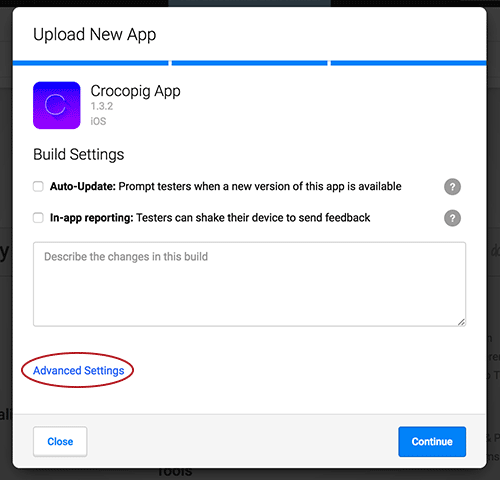

##  Uploading Your Application

Once your account is created and verified, you are ready to upload your app.

To upload an app, in the top menu, click **New Upload**.

We recommend using the <a href="https://docs.testfairy.com/API/Upload_API.html">Upload API</a> to enable the <a href="https://wiki.jenkins-ci.org/display/JENKINS/TestFairy+Plugin">Jenkins plugin</a>, <a href="#">Gradle plugin</a>, or <a href="https://github.com/testfairy/command-line-uploader" target="_blank">Command line uploader</a>.

The code of our command line uploader, Jenkins plugin, and Gradle plugin is open source, so feel free to change and improve it.

## Manual Upload

### Supported Plaforms

  * **Android**: TestFairy supports uploading and distributing Android Applications. In order to distribute Android apps with TestFairy, they must be packaged as an `.apk` or `.aab` file.
  * **iOS**: TestFairy supports uploading and distributing iOS applications. iOS apps can be signed with __AdHoc__, __Development__, or __Enterprise__ certificates. To distribute iOS apps with TestFairy, they must be packaged as an `.ipa` file.
  * **MacOS**: MacOS apps are bundled as `.app` files, however, to distribute MacOS apps with TestFairy, those `.app` files must be zipped into a `.zip` file.

### Choose your Build File
In the first stage you need to choose the file you want to upload. It can be an **.ipa** (for iOS), **.apk** (for Android), or **.zip** (for MacOS) file.

### Project Settings

You can define your build settings during the upload process:

-- **In-app reporting** - Check this box to enable/disable the "shake to report" feature in your app. When enabled, users can shake their device to send a feedback report, along with a video recording, screenshots, logs, and metrics of their test.

-- **Auto-Update** - When auto update is enabled, users using previous versions of this app will get a notification about the new version next time they open up the app. The new version will be downloaded automatically, so the user doesn't have to manually download it. Please note that in this case no email notification will be sent to the testers.

-- **Custom Comments** - Use this section to add release notes, describe the updates/changes, and anything else you would like your testers to be aware of.

**Note:** These settings are relevant only if you added the SDK to your app.

More build settings are available on the Account Settings page.

###  Updating an App

To update a build, upload the same file again (i.e., the same build with the same version). The new build file will override the old build without creating a new app version.

###  Uploading a New Version

To upload a new build (a new version of the same app), upload the new version in the exact same way you uploaded the old version. TestFairy will identify that both apps have the same package name (bundle identifier) and group them together in the same project.
