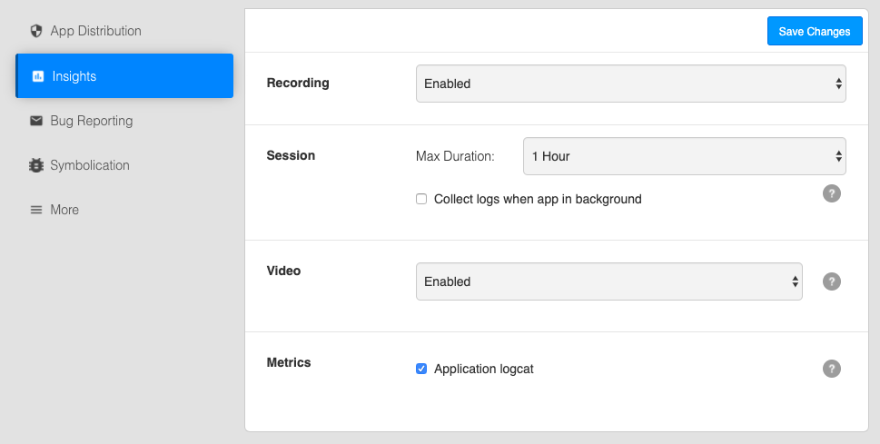
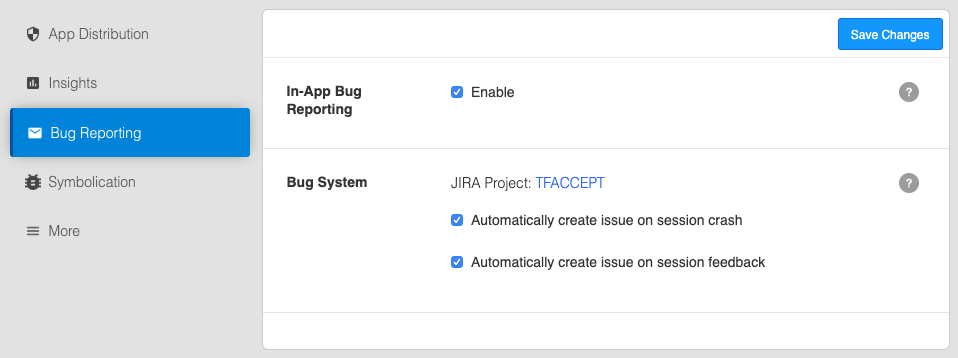
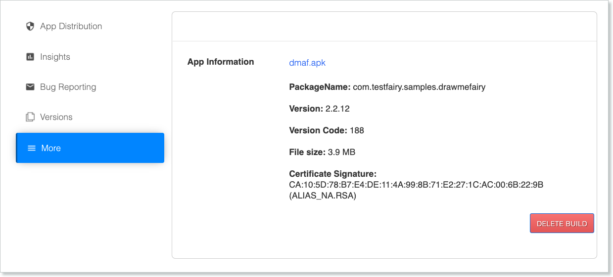

<!-- # Build Settings -->

<iframe width="800" height="600" frameborder="0" allowfullscreen="true" style="box-sizing: border-box; margin-bottom:5px; max-width: 100%; border: 1px solid rgba(0,0,0,1); background-color: rgba(255,255,255,0); box-shadow: 0px 2px 4px rgba(0,0,0,0.1);" src="https://testfairy.fleeq.io/l/aftiqrzoh4-b55x03f9fv"></iframe>

<!--  -->

In order to configure your build settings, click on the **Settings** button of the build menu, right next to the app name and version.

Every build has its own settings, however, some of the definitions are shared by all builds of an app.

### App distribution

* **App Distribution:** Enabled or Disabled. When disabled the app cannot be installed and pending invitations will expire.

* **[Auto-Update](https://docs.testfairy.com/App_Distribution/Auto_Update.html)** - when auto-update is enabled, all the previous installations of this app will be automatically upgraded to this version. The next time a user with an old version opens his app, he will get an 'updating' message and the app will be installed automatically. No email will be sent regarding this update.

* **[Release Notes](https://docs.testfairy.com/App_Distribution/Releas_Notes.html)** These release notes will appear in email invitations, landing pages and in the tester dashboard at my.testfairy.com. Release Notes can be set via upload api, manually on upload or in this page.

* **[Tags]()** Tags can be added to each build. They are comma separated text and can contain spaces.

* **[Metadata]()** Metadata are details received from __Continuous integration (CI)__ systems that upload the build to the TestFairy Dashboard. They can not be edited.

* **[Landing Page](https://docs.testfairy.com/App_Distribution/Landing_Pages.html)** - link to the landing page. Click the  `Configure` button to change the landing page for this build.

### Insights

* __Recording:__ Choose whether recording of sessions is `enabled`, `disabled` or `enabled only when WiFi is on`. This is global and overrides all other settings.

* __Session__: this option defines the maximum length of session recorded.

* __Video__ - Changing video settings can be useful if you wish to decrease network overload: 
    * Enable / Disable video recording     
* __Metrics__:
   * Application logcat - collect the app logs from the device.

### Bug reporting

   
* __[In-App Bug Reporting]__(https://docs.testfairy.com/Testers/Submitting_User_Feedback.html)** - When in-app reporting is enabled tester will be able to shake their device in order to open a bug report. 

* __[Bug System](https://docs.testfairy.com/Bug_Tracking/Overview.html)__ - indicated which JIRA project is connected to this app. The general configuration of bug tracking systems is doen via the [Bug systems](https://app.testfairy.com/settings/bug-system/) menu item in  __Account preferences__.

### Symbolication

See [here](https://docs.testfairy.com/iOS_SDK/Uploading_dSyms_to_TestFairy.html).

### More

In iOS you will see the details of the build as detected by our service. You can see the certificate type you used to sign the app, as well as more details.

In android you will see build details and the hash of the signing certificate at the bottom.

**What to read next:** [Distributing apps](Distributing_Your_Apps.html)

