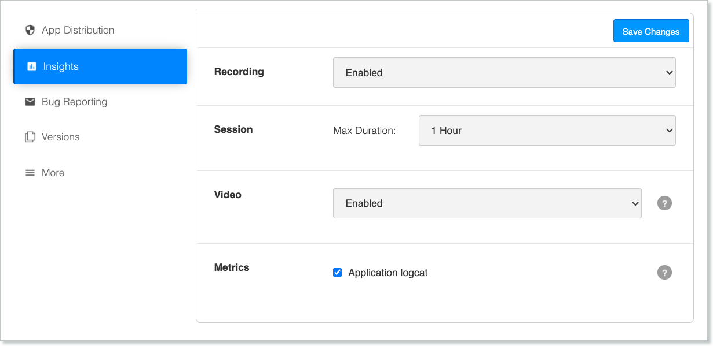

<!-- # Build Settings -->

<!--  -->

To configure your build settings, click the **Settings** button on the build menu, next to the app name and version.

Every build has its own settings, but some settings are shared by all builds of an app.

### App Distribution

* App Distribution - When disabled, the app cannot be installed and pending invitations will expire.

* [Auto-Update](https://docs.testfairy.com/App_Distribution/Auto_Update.html) - When enabled, previous installations of the app will be automatically updated. The next time a user with an old version opens their app, they will be notified that the app will be installed automatically. No email will be sent regarding this update.

* [Release Notes](https://docs.testfairy.com/App_Distribution/Releas_Notes.html) - Release notes will appear in email invitations, on landing pages, and on the tester dashboard. Release notes can be set via Upload API, during manual upload, or on this page.

* Tags - Tags can be added to each build. They are comma separated text and can contain spaces.

* Metadata - Metadata are details received from Continuous integration (CI) systems that upload the build to the TestFairy dashboard. They cannot be edited.

* [Landing Page](https://docs.testfairy.com/App_Distribution/Landing_Pages.html) - Click the  **Configure** button to change the landing page for this build.

### Insights

* Recording - Choose whether recording of sessions is `enabled`, `disabled`, or `enabled only when WiFi is on`. This is global and overrides all other settings.

* Session - This option defines the maximum length of a recorded session.

* Video - Changing video settings can be useful to decrease network overload.

* Metrics:
   * Application logcat - Collects the app logs from the device.

### Bug Reporting

* [In-App Bug Reporting](https://docs.testfairy.com/Testers/Submitting_User_Feedback.html) - When enabled, testers will be able to shake their device to open a bug report.

* [Bug System](https://docs.testfairy.com/Bug_Tracking/Overview.html) - Indicates which Jira project is connected to the app. The general configuration of bug tracking systems is done via the **[Bug systems]**(https://app.testfairy.com/settings/bug-system/) menu in **Account preferences**.

### Symbolication

See [Uploading dSyms to TestFairy](https://docs.testfairy.com/iOS_SDK/Uploading_dSyms_to_TestFairy.html).

### More

In iOS you will see the details of the build as detected by our service. You can see the certificate type you used to sign the app, as well as more details.

In Android you will see build details and the hash of the signing certificate at the bottom.

