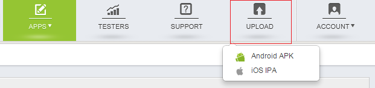
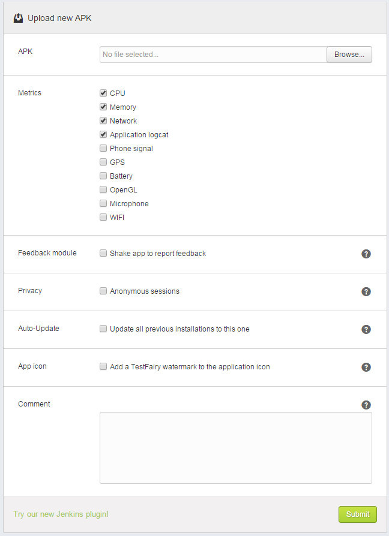

If you don’t have an account yet, please <a href="http://www.testfairy.com/signup" target="_blank">sign up</a>. It is easy and it is free !
If you have a TestFairy account, please  <a href="https://app.testfairy.com/login" target="_blank">log in</a>.

##  Uploading Your Application

Once your account is created and verified, you are ready to upload your app.

Upload is as simple as it sounds, just click on the  **Upload** button on the upper menu, choose your OS and you’re done.

Please note we recommend using our <a href="http://docs.testfairy.com/Upload_API.html">Upload API</a> and use our <a href="https://wiki.jenkins-ci.org/display/JENKINS/TestFairy+Plugin">Jenkins plugin</a>, <a href="#">Gradle plugin</a>, or <a href="https://github.com/testfairy/command-line-uploader" target="_blank">Command line uploader</a>. 

The code of our command line uploader, Jenkins and Gradle plugins is open source. Feel free to change it to make it better.

This guide, as we mentioned above, will continue describing the manual uploads.

## Selecting Your Project Settings

You can define your test settings right from the upload page.

**Selecting Your Project Settings - Android APK.**

Here are the parameters you can set up from the **Upload** page.
Additional settings can be configured from the <a href="http://docs.testfairy.com/Getting_Started/Account_Settings.html">Project Settings</a> page.

 * CPU
 * Memory
 * Network
 * Application logcat
 * Phone signal
 * GPS
 * Battery
 * OpenGL
 * Microphone
 * WIFI

In addition, you can set the following parameters:

-- **Auto-Update** - When auto update is enabled, users using previous versions of this app will get a notification about the new version next time they use the app. Download of the new version will start immediately, the user will not have to actively download it. Note that in this case no email will be sent to the testers.

-- **Comment** - add any comments you would like your testers to receive in the update email

**Selecting Your Project Settings - iOS IPA.**

Here are the parameters you can set up from the **Upload** page.
Additional settings can be configured from the <a href="http://docs.testfairy.com/Getting_Started/Account_Settings.html">Project Settings</a> page.

 * CPU
 * Memory
 * Application logs
 
##  Updating an app

If you wish to update an app, all you need to do is upload again the same app with the same version. The new file will override the old file.

##  Uploading a new version

If you wish to upload a new version of the same app, all you need to do is upload the new version the same way you uploaded the old version. Our service will identify that both apps have the same package name (budle id) and group them together in the same project.

**What to read next:** [How To Invite Testers](How_To_Invite_Testers.html).
