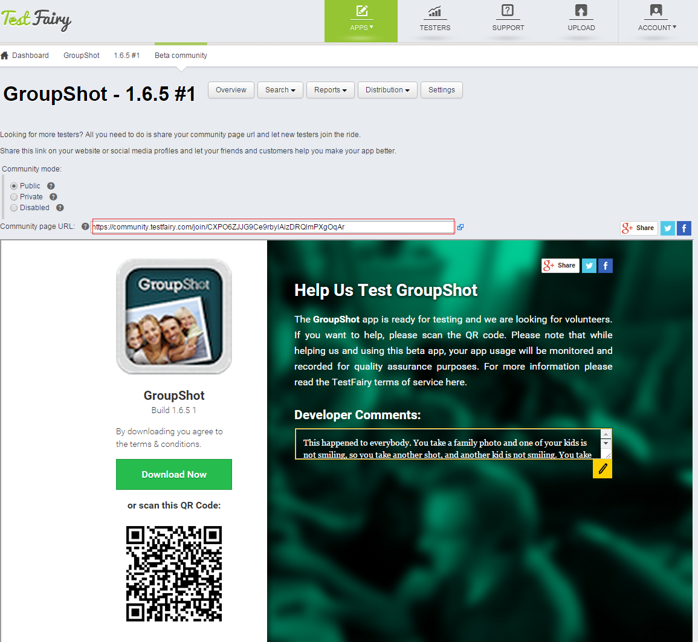
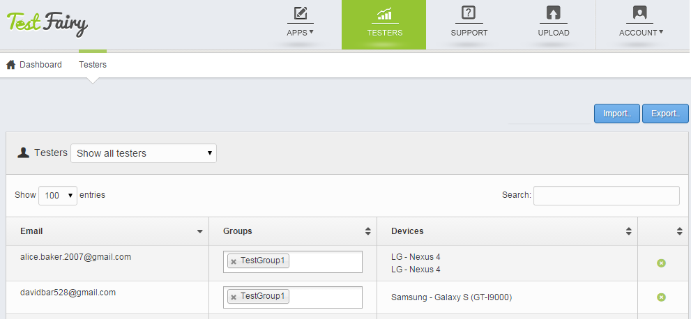

<!-- # Inviting Testers -->

Once the new version of your app is uploaded to your account, you can let your testers know about it and invite them to start testing. There are a couple of ways to let your testers know about your new upload. 

You can choose to invite your testers via email or you can build a community of testers by using our pre-designed landing page.

### Inviting Testers by Email

To invite or notify testers by email, go to the build menu, right next to your app name and version, and select **Invite Testers**.
You can add testers manually or [import lists of testers](https://app.testfairy.com/testers/import/) in csv format.

iOS only: If you are **not** using an [iOS Enterprise certificate](https://developer.apple.com/programs/ios/enterprise/), you will need to get the UDID's of your testers' devices before sending them your app. When you invite new testers by email, your testers will get an email asking them to register their device. Once they click on the registration link, you will get an email with their UDID and their device details will be added to your [testers page](https://app.testfairy.com/testers).
For more information about how to add UDIDs to provisioning profiles please read [this guide](http://docs.testfairy.com/iOS_SDK/Adding_UDIDs_to_iOS_development_profile.html).

### The TestFairy Beta Community Pages

TestFairy creates a beta community page for each one of your apps. It make it extremely easy to get new testers by allowing testers to  download your app in just one click. The beta community can be configured to work in public mode that allows anyone to get the app direclty or in private mode that allows testers to request to join the beta and be approved manually.
You can share this page on social meida by using the Facebook, Twitter or Google+ butttons at the top right corner of he page.

Once on the landing page, choose between **Public** and **Private** versions, fill in the app description and share the page with your audience.

<!--  -->

 
 <a href="https://community.testfairy.com/join/jHWsEbrfwF7e7UjUjwDZ7h8xanScHLs0" target="_blank">Here</a>  you can see an example of a live landing page of an exciting new application **Badoo**, a social network where you can meet new people.

### Managing Testers Groups

To see all the testers you have for your app, invite new individual testers or import/export a list of testers, click the **Testers** button on the top menu.  

You can also divide testers to **groups** to add more structure and organise your testing efforts. 
You can then invite only testers in a specific group to test a new build from the  **Distribution ->Invite Testers By Email** page.

<!--  -->

 
**What to read next:** [How To Analyze Test Results](How_To_Analyze_Test_Results.html).

