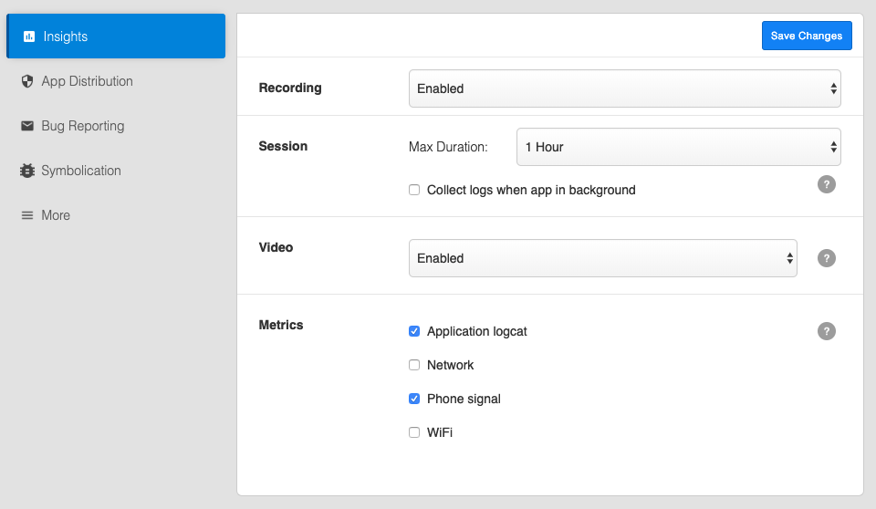
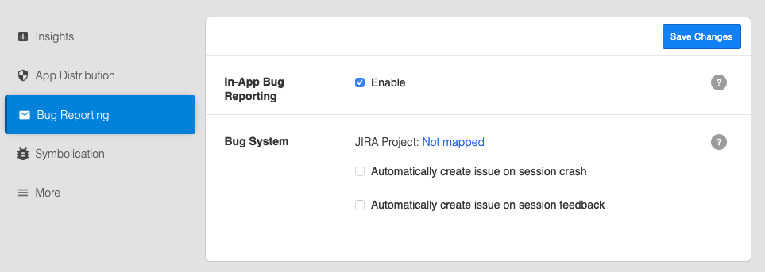
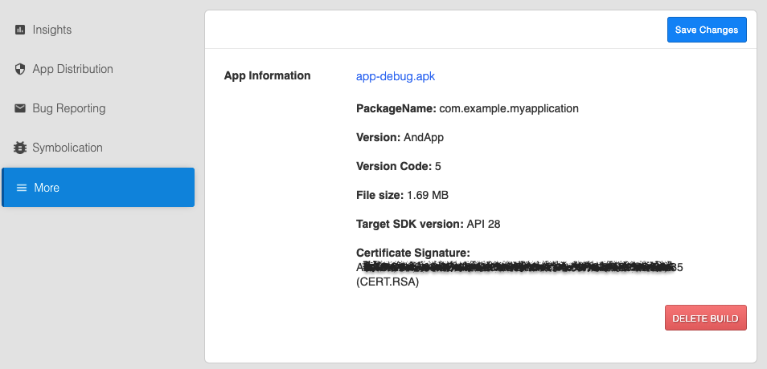

<!-- # Build Settings -->

<iframe width="800" height="600" frameborder="0" allowfullscreen="true" style="box-sizing: border-box; margin-bottom:5px; max-width: 100%; border: 1px solid rgba(0,0,0,1); background-color: rgba(255,255,255,0); box-shadow: 0px 2px 4px rgba(0,0,0,0.1);" src="https://testfairy.fleeq.io/l/aftiqrzoh4-b55x03f9fv"></iframe>

<!--  -->

In order to configure your build (version) settings, click on the **Settings** button of the build menu, right next to the app name and version.

Every build has its own settings, however, some of the definitions are shared by all builds of an app.

### Insights

* __Recording:__ Choose whether Insights is enabled, disabled or enabled only when WiFi is on. This is global and overrides all other settings.

* __Max Duration:__ you can choose a maximum recording duration of 10 min, 1 or 5 hour. When going to background, session will automatically end after 5 minutes the app is in background.

* __Collect Logs in background (only in android)__: this option will enable collecting logs also when the app is in the background.  Please note that this option may cause additional battery consumption.

* **Video settings** - Changing video settings can be useful if you wish to decrease network overload: 
    * Enable / Disable video recording     
* **Metrics**:
   * Application logs
   * Network (Android only)
   * Phone signal (Android only)
   * WIFI (Android only)

### App distribution

* **App Distribution:** Enabled or Disabled. When didabled the app cannot be installed and pending invitations will expire.

* **Auto-Update** - when enabled, all the previous installations of this app will be automatically upgraded to this version. The next time a user with an old version opens his app, he will get an 'updating' message and the app will be installed automatically. No email will be sent regarding this update.

* **Landing Page** - click the button to configure the landing page for this build.

* **Release Notes:** These release notes will appear in email invitations, landing pages and in the tester dashboard at my.testfairy.com. Release Notes can be set via upload api, manually on upload or in this page.

### Bug reporting

   
* **In-App Bug Reporting** - when enabled, testers can provide feedback simply by shaking their device and filling a form that pops up. On iOS, screenshot will trigger the same mechanism. 

* **Bug System** - indicated which JIRA project is configured for this app. the general configuration of bug tracking systems is doen via the [Bug systems](https://app.testfairy.com/settings/bug-system/) menu item in the account preferences.

### Symbolication

See https://docs.testfairy.com/iOS_SDK/Uploading_dSyms_to_TestFairy.html

### More

In iOS you will see the details of the build as detected by our service. You can see the certificate type you used to sign the app, as well as more details.

In android you will see build details and the hah of the signing certificate at the bottom.

**What to read next:** [Account Settings](Account_Settings.html)
