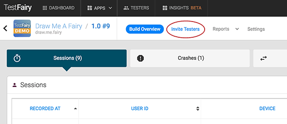
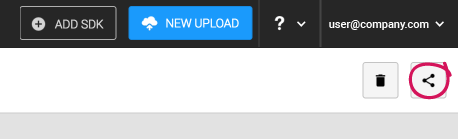
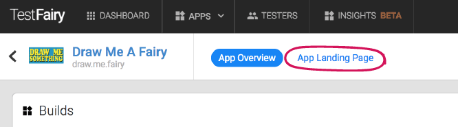
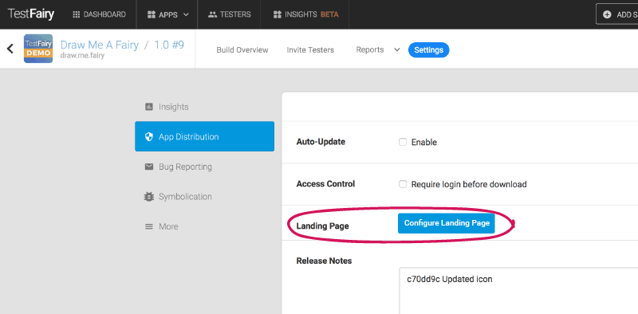
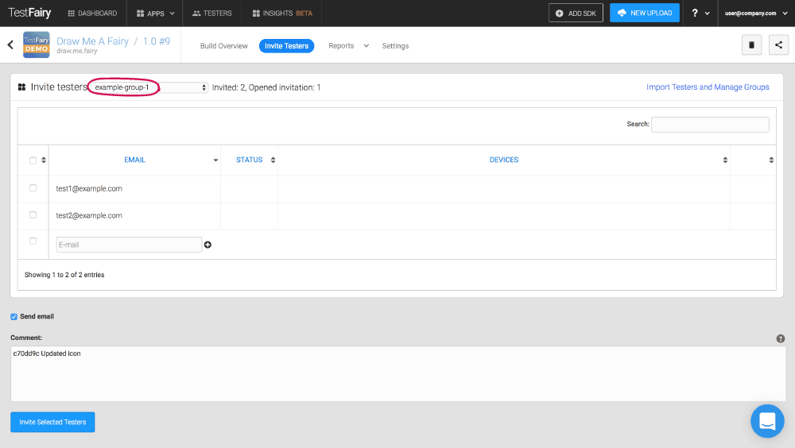

<!-- # Inviting Testers -->

<iframe width="854" height="480" src="https://www.youtube.com/embed/Y2KpYgi8wLI" frameborder="0" allow="autoplay; encrypted-media" allowfullscreen></iframe>

Once the new version of your app is uploaded to your account, you can let your testers know about it and invite them to start testing. There are a couple of ways to let your testers know about your new upload. 

You can choose to invite your testers via email or you can build a community of testers by using our pre-designed landing page.

### Inviting Testers by Email

To invite testers by email, go to the TESTERS Tab, and click on the `Add Testers` Button. In the list box add tester emails  - one for each row.
You can also select a Group for the testers in the list or just leav it blank.
After you finished press the `Add Testers` button below the list to complete the process.

You can add testers manually or [import lists of testers](https://app.testfairy.com/testers/import/) in csv format.

______
                
 **Note for iOS only**
         If you are **not** using an [iOS Enterprise certificate](https://developer.apple.com/programs/ios/enterprise/), you  will need to get the UDID's of your testers' devices before sending them your app.   
         When you invite new testers by email, your testers will get an email asking them to register their device. Once they click on the registration link, you will get an email with their UDID and their device details will be added to your [testers page](https://app.testfairy.com/testers).  
         For more information about how to add UDIDs to provisioning profiles please read [this guide](http://docs.testfairy.com/iOS_SDK/Adding_UDIDs_to_iOS_development_profile.html).
______

### The TestFairy Landing Pages

TestFairy automatically creates a landing page for each one of your apps. It make it extremely easy to get new testers, by allowing testers to download your app with just one click or a QR code scan. The landing page can be configured to work in public mode, which allows anyone to get the app direclty, or in private mode, which allows testers to request to join the beta and be approved manually.

To see your landing page from any version of your app, click on the **"share"** button on the top right corner of your build menu.

To modify the settings of your page, you can either:
 
  1. Click on **"App Landing Page"** in your app menu (right next to the app name) 
  
  
  
  2. Go to "settings" in your build menu, and look for "Landing Page" under the "App distribution" section.

  

Once in the [landing page settings](https://docs.testfairy.com/App_Distribution/Landing_Pages.html), you can choose your privacy setting, fill in the app description, customize your page's stylesheet and share the page with your audience.

### Managing Tester Groups

To see all the testers you have for your app, invite new individual testers or import/export a list of testers, click on **Invite Testers** in the build menu.

You can also divide testers to **groups** to add more structure and organise your testing efforts. 
You can then invite a select number testers in a specific group to test a new build. Simply select your testers and click "Invite selected testers" on the bottom of the page to send them an email invitation.

 
**What you should read next:** [How To Analyze Test Results](How_To_Analyze_Test_Results.html).

