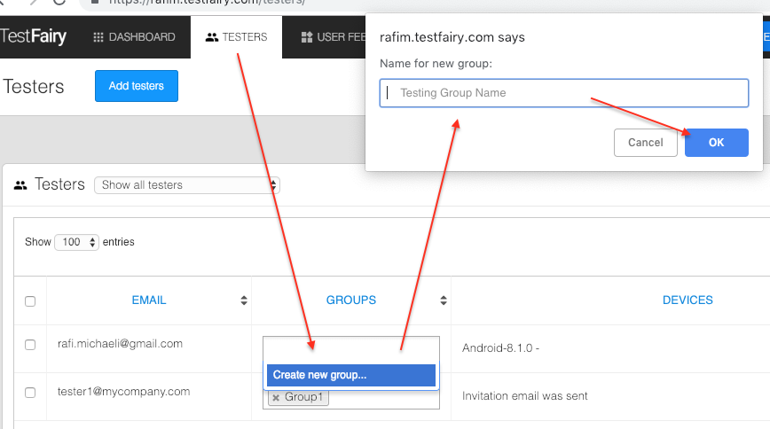

<!-- # Inviting Testers -->

<iframe width="854" height="480" src="https://www.youtube.com/embed/Y2KpYgi8wLI" frameborder="0" allow="autoplay; encrypted-media" allowfullscreen></iframe>

Once the new version of your app is uploaded to your account, you can let your testers know about it and invite them to start testing. 

There are a couple of ways to let your testers know about your new upload: 

You can choose to invite your testers via email or you can build a community of testers by using our pre-designed [landing page](https://docs.testfairy.com/App_Distribution/Landing_Pages.html).

### Managing Testers

To see all the testers you have for your app, invite new testers or import/export a list of testers, click on the **TESTERS** tab.

### Inviting Testers by Email

To invite testers by email click on the `Add Testers` Button. 
In the list box add tester emails  - one for each row.

You can also select a Group for the testers in the list or just leave it blank (see managing tester groupd below).
After you finished press the `Add Testers` button below the list to complete the process.

You can add testers manually or [import lists of testers](https://app.testfairy.com/testers/import/) in csv format.

______        
###### **Note for iOS only**
  If you are **not** using an [iOS Enterprise certificate](https://developer.apple.com/programs/ios/enterprise/), you  will need to get the UDID's of your testers' devices before sending them your app.   
         When you invite new testers by email, your testers will get an email asking them to register their device. Once they click on the registration link, you will get an email with their UDID and their device details will be added to your [testers page](https://app.testfairy.com/testers).  
         For more information about how to add UDIDs to provisioning profiles please read [this guide](http://docs.testfairy.com/iOS_SDK/Adding_UDIDs_to_iOS_development_profile.html).
______

You can also divide testers to **groups** to add more structure and organise your testing efforts. 
In order to create a group click in the GROUPS text-box and then on `Create new group...`
Choose a group name and pree OK. The tester you clicked in his group will be assigned the group you just created.

Tester groups help you manage the invitation process to your apps. If you want to invite a number of testers that are all under the same group simply filter the list of testers according to that group and then select all and invite them.

In order to delete a group you will first have to delete all its mentions in the GROUPS field. Delete the group by pressing the `x` next to it sname. Once you delete all its occurances it will de deleted. Refresh the apage to make sure it was deleted.

 
**What you should read next:** [How To Analyze Test Results](How_To_Analyze_Test_Results.html).

