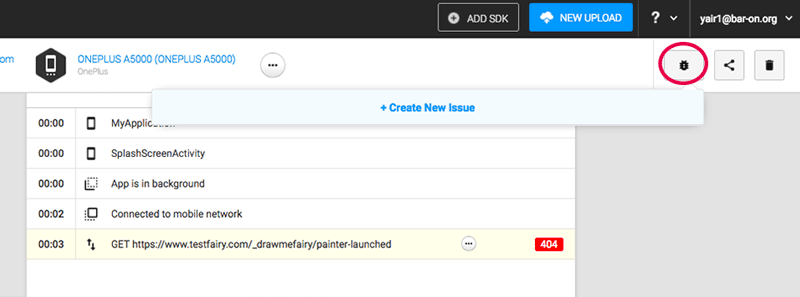
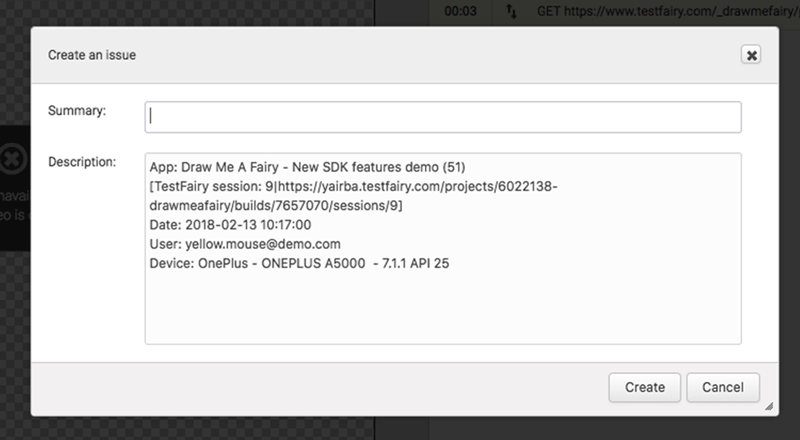

<!-- ## Reporting Bugs -->
 
### Shake to create Feedback

When the [TestFairy SDK](https://docs.testfairy.com/SDK/Adding_The_SDK_To_Your_App.html) is defined in your app shaking the device will prompt the user to create a feedback issue from within the app.
The issue will appear with an automatically generated screenshot of the app which can be annotated and a feedback form where details like email and description can be added. 

<iframe width="854" height="480" src="https://www.youtube.com/embed/lVlXx01jrU8" frameborder="0" allow="autoplay; encrypted-media" allowfullscreen></iframe>

A link to the tester's account is automatically sent to the testers together with the invitaion to start testing your app.

*It is possible to configure your account to automatically post feedbacks into your JIRA, Bugzilla or Github account. In order to enable this feature, please contact our [support team](https://app.testfairy.com/contact).

### Issue Reporting by Developers

After the session is finished, developers can also add their bug reports directly from the session page, by by clicking on the **Create Bug** button on the top right side of your **Session Overview** page.

 
A **Bug Creation** dialogue box opens up. Everything you type in the dialogue will be inserted directly into a new issue in your bug reporting system.

**What to read next:** 
[Build Settings](Build_Settings.html) 
 
