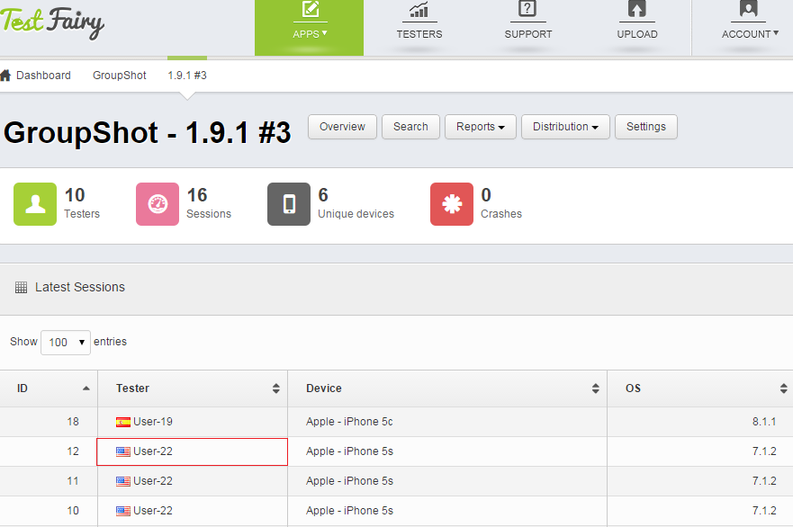
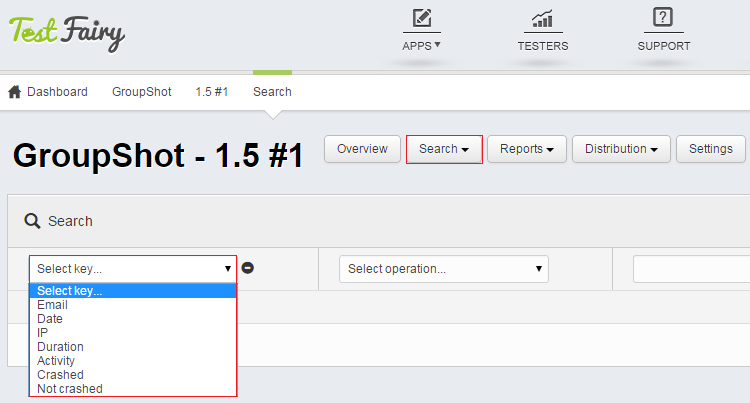
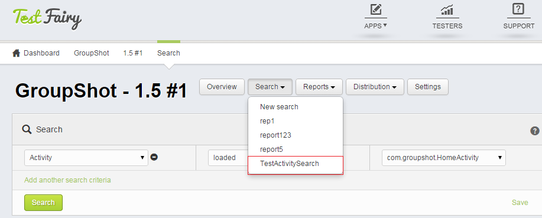
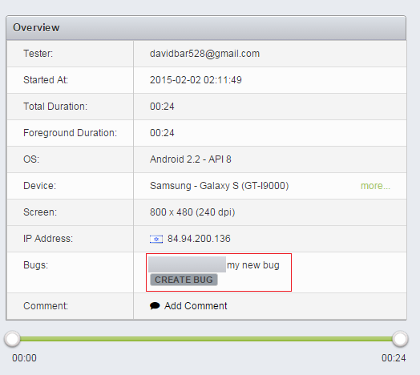
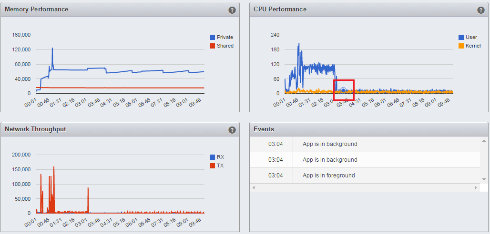

<!--# Testing your Application-->

One of the great advantages of TestFairy is the ease of use for you and your testers. 

Once you uploaded your app and invited your testers, they can download the app in one click. If you seletced **Auto Update** option, the testers won’t even have to do the one click to download each new version. Next time they use your app, a message will pop up notifying the user that a new version is available, and the download will start automatically.

Your users do not need to do anything in order to start the video recording. Once they start using the app, video recording and data collection will start automatically. Sending back the application data is as seamless as the installation - your testers just use the application in a regular way and TestFairy takes care of the rest. All you need to do as a developer is seat back, relax and watch the data appear on your TestFairy dashboard, showing your testers' behaviour in real time.

## Analyzing your Test Sessions

Once your testers received the invitation and downloaded the new version of your app, the fun begins.  To analyze your test sessions, choose your application from the **Apps** menu on the top of the page and select the build you are testing now from the **Build Table**. If only one build was uploaded, this additional screen will be skipped automatically.

<!--  -->

##  Testing Overview

Once you clicked on the version you are testing, you arrive at the **Build Overview** page, where you can see all your latest sessions, together with charts for **Geography, Resolutions, Devices** and **OS Versions** tested.

To dive into the details of each session, just click on one of the session rows.

<!--   -->

The screenshot above shows user names as User-1, User-2 etc. In order to assign real names to annonymous users, please use CorrelationId on [iOS](http://docs.testfairy.com/iOS_SDK/Correlation_Id.html) or [Android](http://docs.testfairy.com/Advanced/Correlation_Id.html).

If you want to find a particular session, or filter sessions according to a specific criteria, use the **Session Search** feature.
You can find sessions that interest you by selecting one of the following filtering criteria:

 * Email
 * Date
 * IP
 * Duration
 * Activity
 * Crashed
 * Not Crashed
 

 
 Save your search criteria to easily come back to useful searches.
 
<!--  -->

## Session Analysis

The **session** page shows you full, comprehensive and synchronized view of all the relevant information:

* **session overview**

  

* **screen shots**

  
  
  
* **video recordings**

   
   
   
* **application logcat**

  
  
  
* In accordance with the metrics you decided to record, you can see performance graphs of CPU, memory, network and other parameters. All the graphs are synced with the video recording, so you can see exactly what happens to the device in every moment of each session. You no longer have to rely of tester's description of how exactly they used your app and what action caused a bug - you can see everything with your own eyes.  Just how cool is that ?! 

 Note how the performance graphs are synced with the video (see how the little blue circle on the CPU performance graph moves along when you play the video).
 
 

 

**What to read next:** [Bug Reporting](Bug_Reporting.html).

