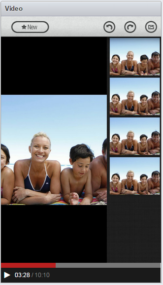
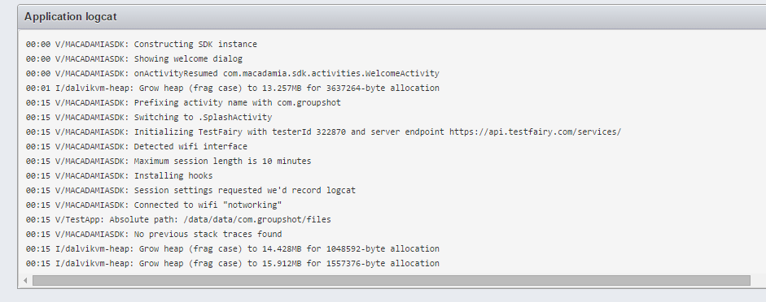
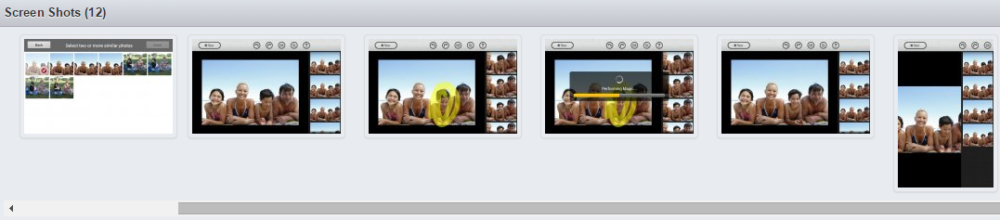

<!--# Testing your Application-->

One of the great advantages of TestFairy is the ease of use for you and your testers. 

Once you uploaded your app and invited your testers, they can download the app in one click. If you seletced **Auto Update** option in the **"Build Settings"** page, the testers won’t even have to worry about it any more, as newer versions are automatically updated. 

Your users do not need to do anything in order to start the video recording. Once they start using the app, video recording and data collection will start automatically. Sending back the application data is as seamless as the installation - your testers just use the application regularly, and TestFairy takes care of the rest. All you need to do as a developer is sit back, relax and watch the data appear on your TestFairy dashboard, showing your testers' behaviour in real time.

## Analyzing your Test Sessions

To analyze your test sessions, choose the app from the **Apps** menu on the top of the page and select a version from the presented chart. 

<!--  -->

##  Session Overview

Once in **Build Overview**, you can see all your testing sessions presented in a chart with relevant statistics.
To dive into the details of each session, just click on a session row to see the video recording and data collected during the session.

If you want to find a particular session, or filter sessions according to specific criteria, click on **"Insights"** on the top navbar, next to the app selection menu.

## Session Overview

The **Session Overview** page shows you a full, comprehensive and synchronized view of all the relevant information collected in a single session:

* **video recordings**

   
   
* **application logs**

  

  * **Metrics**: Below the video recording and logs, you can see performance graphs of CPU, memory, network and other parameters. All the graphs are synced with the video recording, so you can see exactly what happens to the device in every moment of each session.

  
  
  * **screen shots**

  
  

 

**What you should read next:** [Bug Reporting](Bug_Reporting.html).

