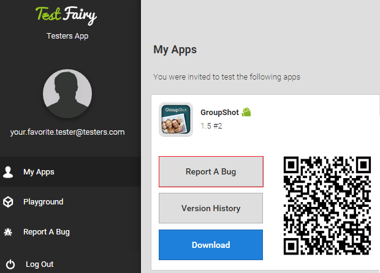
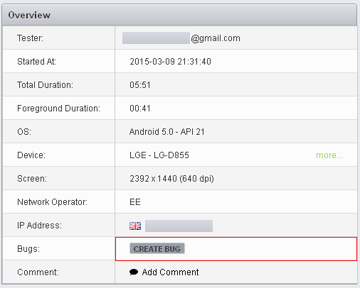
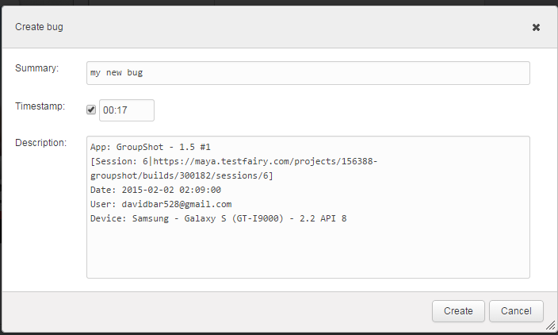

<!-- ## Reporting Bugs -->

TestFairy has a seamless, bi-directional integration with **Bugzilla**, **JIRA** and **GitHub**. In order to connect to a bug reporting system, all you need to do is provide the credentials on your <a href="http://docs.testfairy.com/Getting_Started/Account_Settings.html">Account Settings</a> page. Once the connection is set up, you can choose to report bugs **manually** or **automatically, via API**.

 
### Manual Issue Reporting by Testers

When a bug is found during a testing session, testers can report back in several ways.

* Logging into the testers dashboard at [https://my.testfairy.com](https://my.testfairy.com)
* Logging to the [Android](https://play.google.com/store/apps/details?id=com.testfairy.app) or [iOS](https://itunes.apple.com/app/testfairy/id977307991) testers app.
* Shaking the device and fill in a feedback form that pops up (available only on the enterprise package) 

A link to the tester's account is automatically sent to the testers together with the invitaion to start testing your app.

*It is possible to configure your account to automatically post feedbacks into your JIRA, Bugzilla or Github account. In order to enable this feature, please contact our [support team](https://app.testfairy.com/contact).

### Issue Reporting by Developers

After the session is finished, developers can also add their bug reports, directly from the session page, by by clicking on **CREATE BUG** right from the **session** page.

 
A **Bug Creation** dialogue box opens up. Everything you type in the dialogue will be inserted directly into a new issue in your bug reporting system.

**What to read next:** 
[Build Settings](Build_Settings.html) 
 
