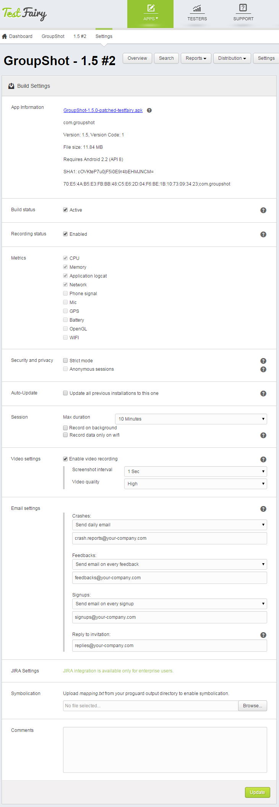

<!-- # Build Settings -->

<!--  -->

Note that this documents describes build settings of Android apps. For iOS build settings, please [click here](Build_Settings_for_iOS.html).

In order to configure your build settings, click on the **Settings** button on your build screen.
Every build (version) has its own settings, however some of the definitions are shared by all the builds of an app.

Note that some recording metrics are configured during the build upload stage and can not be changed for an existing build. On this page you can see their status, but not alter them. If you wish to change these parameters, please upload a new build and configure these on the [Upload](Upload.html) page.

This is how **build settings** look on an Android project:

 * App information - name, version, file size, Min SDK (the minimum version of Android OS that can run this app)  as well as a link to an instrumented version of your application.

<!-- YAIR: SHA1  -->

 * Build status - When a build status is inactive, installed apps will stop working and pending invitations will expire.
 
 * Recording status - When recording is disabled, installed apps can continue to work, however no test data will be collected.
 
 * Metrics:
   * CPU
   * Memory
   * Application logcat
   * Network
   * Phone signal
   * Microphone
   * GPS
   * Battery
   * OpenGL
   * WIFI

   
 * Feedback module - when enabled, testers can provide feedback by shaking their device and filling a form that pops up. 
This feature is included in the TestFairy enterprise package.

 * Security and privacy 
    * Strict mode - when enabled, users must login for app download. 
    * Anonymous sessions - when enabled, user device information will not be recorded and sessions will apear as anonymous.
    
 * Auto-Update - when enabled, all the previous installations of this app will be automatically upgraded to this version. Next time a user with an old version opens his app, he will get see a message 'updating' and the app will be installed. No email will be sent regarding this update.

 * Session 
   * Max duration - determines the maximum recording time. This feature does not influence app usage, users can still use the app more than max duration, however no recording will be made.
   * Record on background - if enabled, logs and other metrcis (no screen) will be recorded when the app is on the background. Please note that this option might affect battery consumption.
   * Record data only on wifi - when checked,  data will be recorded and sent back to TestFairy only when wifi is avialable.
  
 * Video settings. Changing video settings can be useful in case you wish to decrease network overload. 
    * Enable video recording - whether video recording should be enabled.
    * Screenshot interval - increase interval if you need to decrease network overload.
    * Video quality - decrease video quality if you need to decrease network overload.
   
 * Email settings - define who will receive various email notifications and how often. You can specify a separate email address for each type of event. To send event notifications to multiple email addresses, separate the addresses with a comma.

    You can get notified about the following types of events:
 
     * crashes 
     * feedbacks - when testers reported feedback via app, web or shake options.
     * signups - when testers joined beta community in private mode.
     * invitation replies. Invitations for testers will be sent from support@testfairy.com. By default, replies to these invitations will be sent to the address of the devloper who uploaded the app. This can be modified here.

 * JIRA settings - included in Enterprise/Startup packages.
  
 * Symbolication - upload a **mapping.txt** file from your proguard output to enable symbolication.
(Symbolication allows to translate addresses in crash reports to function names, method names, file names and line numbers).
 * Comments - your comments for this build will be also appear in email invitations for testers and in testers app.
 
    

<!--  -->

**What to read next:** [Account Settings](Account_Settings.html)

