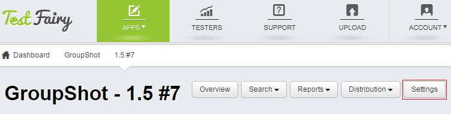
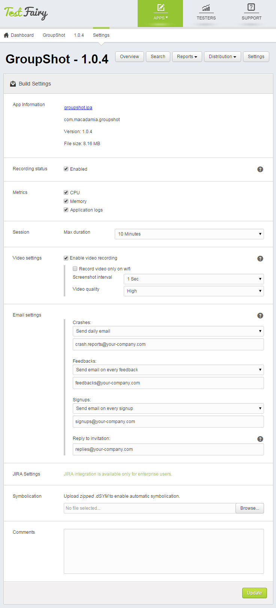
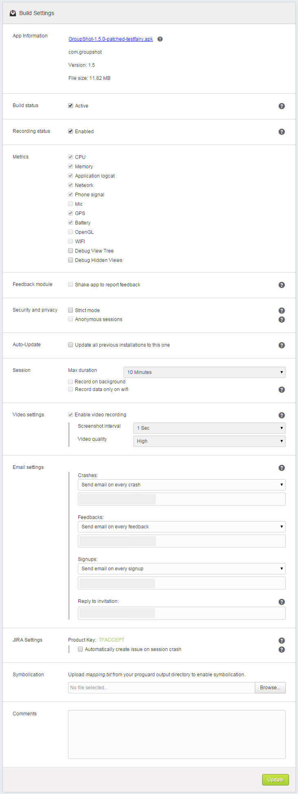

<!-- # Build Settings -->

 
<!--  -->

Note that this documents describes build settings of iOS apps. For Android build settings, please [click here](Build_Settings_for_Android.html).

In order to configure your build settings, click on the **Settings** button on your build screen.
Every build (version) has its own settings, however some of the definitions are shared by all the builds of an app.

Note that some recording metrics are configured during the build upload stage and can not be changed for an existing build. On this page you can see their status, but not alter them. If you wish to change these parameters, please upload a new build and configure these on the [Upload](Upload.html) page.

This is how **build settings** look on an iOS project:

 * App information - path, version, file size and a link to your application. 
 
 * Recording status - whether the build recording is enabled. When recording is disabled, installed apps can continue to work, however no test data will be collected.
 * Metrics:
   * CPU
   * Memory
   * Application logs
   
 * Session: 
   * Max duration of sessions can be set here. This feature does not influence app usage, users can still use the app more than max duration, however no recording will be made.
  
 * Video settings. Changing video settings can be useful in case you wish to decrease network overload. You can see every session video size at the top right info box of the session page.
   * Enable video recording - whether video recording should be enabled.
   * Record video only on wifi - when checked, video will be recorded and sent to your TestFairy account only when wifi is present.
   * Screenshot interval - increase interval if you need to decrease network overload.
   * Video quality - decrease video quality if you need to decrease network overload.
   
 * Email settings - define who will receive various email notifications and how often. You can specify a separate email address for each type of event. To send event notifications to multiple email addresses, separate the addresses with a comma.

    You can get notified about the following types of events:
 
     * crashes 
     * feedbacks - when testers reported feedback via app, web or shake options.
     * signups - when testers joined beta community in private mode.
     * invitation replies. Invitations for testers will be sent from support@testfairy.com. By default, replies to these invitations will be sent to the address of the devloper who uploaded the app. This can be modified here.

 * JIRA settings - included in Enterprise/Startup packages.
  
 * Symbolication - upload a **mapping.txt** file from your proguard output to enable symbolication.
(Symbolication allows to translate addresses in crash reports to function names, method names, file names and line numbers).
 * Comments - your comments for this build will be also appear in email invitations for testers and in testers app.
 
 

<!--  -->

**What to read next:** [Account Settings](Account_Settings.html).
