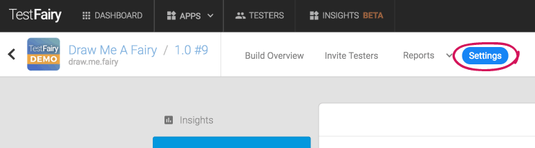
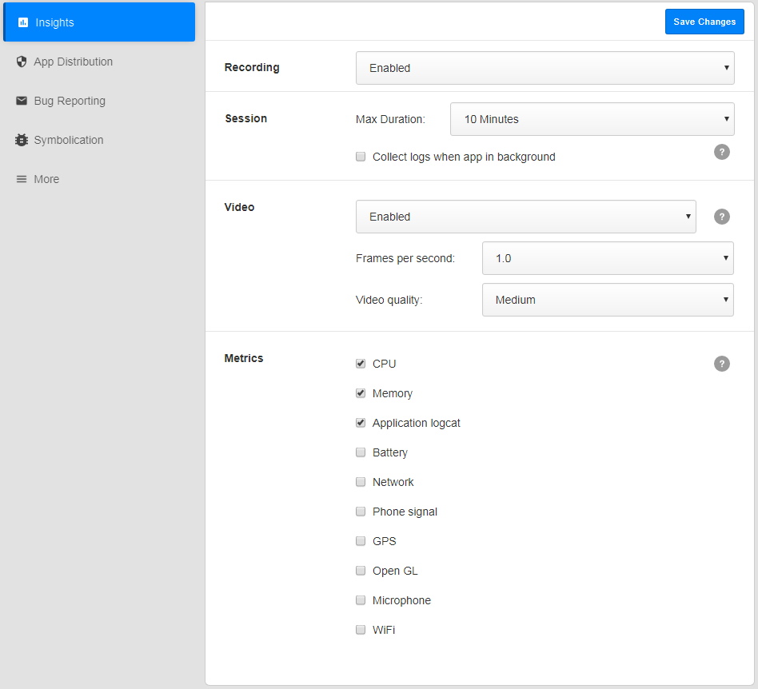
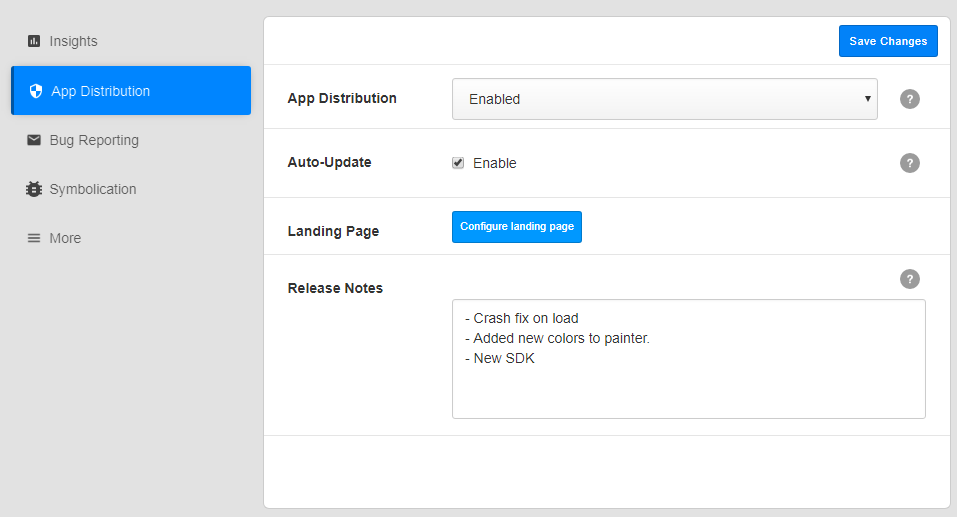
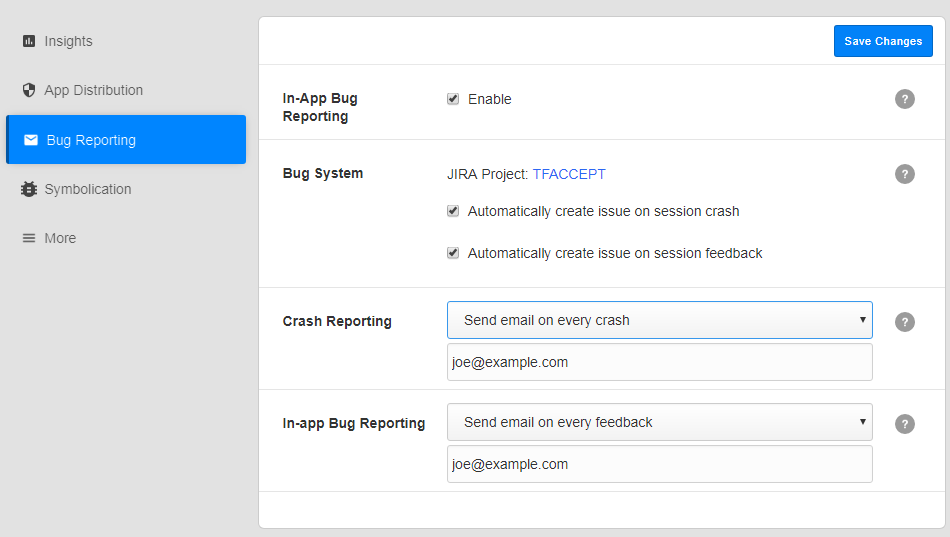

<!-- # Build Settings -->

In order to configure your build (version) settings, click on the **Settings** button on your build menu, right next to the app name and version.
Every build has its own settings, however, some of the definitions are shared by all builds of an app.

<!--  -->

The first section is the Insights section.

* Recording: Choose wether Insights is enabled, disabled or eabled only when WIFI is enabled. This is global and overrides all other settings.

* Max Duration: Choose recording max duration. When going to background, session will automatically end after 5 minutes in background.

* Collect Logs in background: Please note that this option will cause some battery consumption. Use it only if logs are needed.

* **Video settings** - Changing video settings can be useful if you wish to decrease network overload: 
    * Enable video recording 
    * Screenshot interval - increase the interval to decrease network overload.
    * Video quality - decrease the video quality to decrease network overload.
    
* **Metrics**:
   * CPU
   * Memory
   * Application logs
   * Network (Android only)
   * Phone signal (Android only)
   * Battery (Android only)
   * WIFI (Android only)

* App Distribution Enabled: When a build status is disabled, app cannot be installed. Pending invitations will expire.

* Auto-Update - when enabled, all the previous installations of this app will be automatically upgraded to this version. The next time a user with an old version opens his app, he will get an 'updating' message and the app will be installed automatically. No email will be sent regarding this update.

* Landing Page - click to configure.

* Release Notes: These release notes will appear in email invitations, in landing pages and in tester dashboard (my.testfairy.com). Release Notes can be set via upload api, or manually on upload or in this page.

   
 * **In-App Bug Reporting** - when enabled, testers can provide feedback simply by shaking their device and filling a form that pops up. On iOS, screenshot will trigger the same mechanism. 

* **Bug System** - Configure which JIRA project will get all issues created by this project. Crashes and Feedbacks.
  

**What to read next:** [Account Settings](Account_Settings.html)

