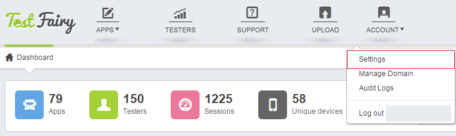
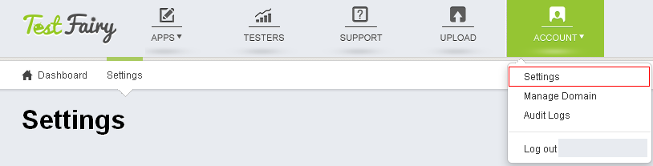
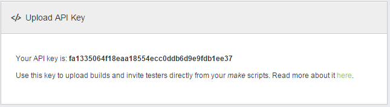
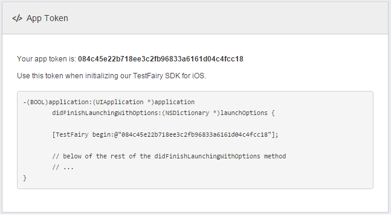
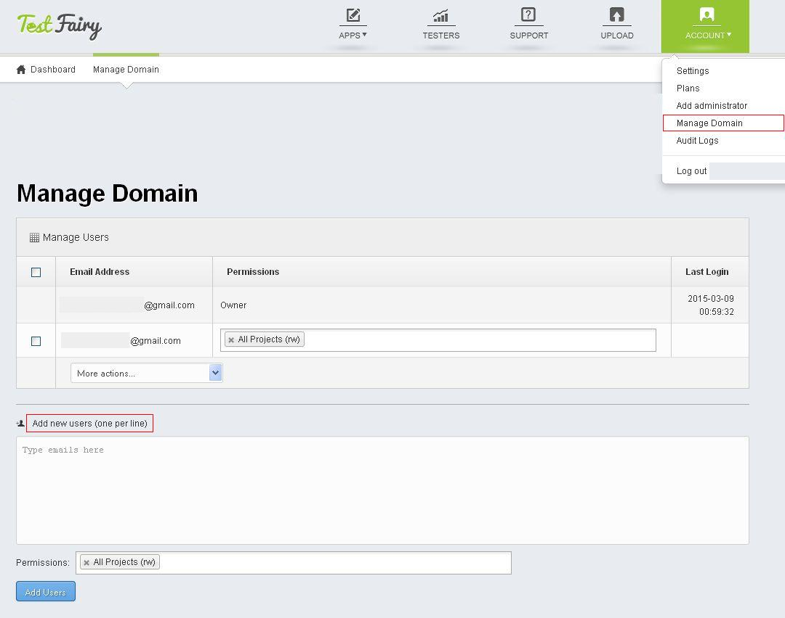

<!-- #   Account Settings -->

On your **Account Settings** page you can do the following: change your password, customize your account timezone and session duration, integrate your bug system and get your **API Key** and **App Token**.

<!--  -->

To use TestFairy API to directly upload builds and invite testers, use the **Upload API Key**.

For more information please read the [Upload API](http://docs.testfairy.com/Upload_API.html) guide.

You can find your **App Token** here for initializing the TestFairy SDK for iOS.

**Adding and Managing Users**

You can add more users to your project from **Account -> Manage Domain** page.
Our enterprise accounts allow for multiple administrators as well.

<!--  -->

**What to read next:**  [How To Connect To Your Bug System](How_To_Connect_To_Your_Bug_System.html)
 
