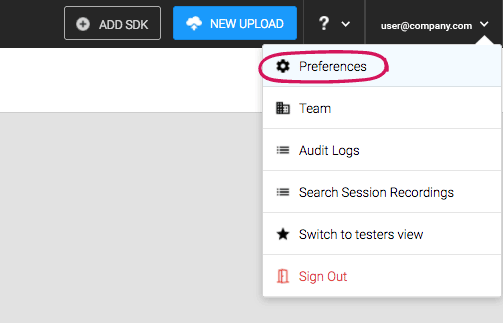
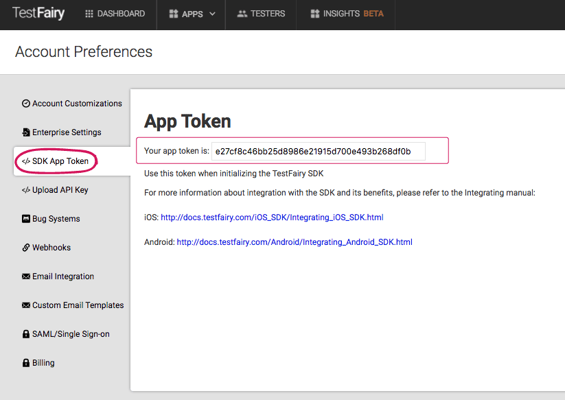
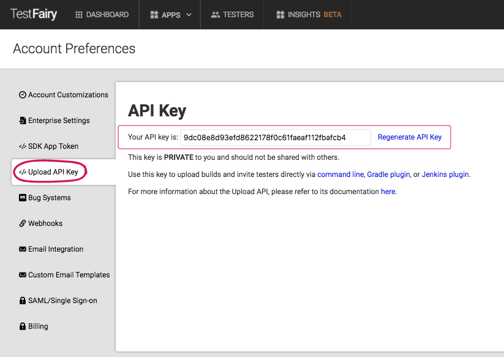

Global definitions for your account are done in the Preferences menu.
 

 
The first 2 menu items are your SDK and API app tokens.

### SDK token

 
Your App Token is used to initializing the [TestFairy SDK](https://docs.testfairy.com/SDK/Adding_The_SDK_To_Your_App.html). 
 

### API key

 
You can use the TestFairy API to directly upload builds and invite testers. For more information please read the [Upload API](https://docs.testfairy.com/API/Upload_API.html) guide.
 

### Notifications
The notifications options are used to define what type of messages you want to receive about new builds, crashes and user feedback.

 

### Integrations
You can integrate your TestFairy account with different services in order to customize and streamline your work processes.

* __SMTP and Gmail__: look [here](https://docs.testfairy.com/Integrations/SMTP_and_Gmail.html) how to connect your SMTP email server or your gmail account (including enterprise G suite) so the emails you send from your TestFairy account will be sent from your business email and you will be able to see the sent items in your email account.

* __Slack:__ see [here](https://docs.testfairy.com/Integrations/Slack.html) for how to integrate your slack account with testfairy.

* __Webhooks:__ you can also connect various services using our webhooks. Here is an example how to connect [MSFT Teams](https://docs.testfairy.com/Integrations/Microfost_Teams.html)

### Bug Systems
When you connect your bug system to the TestFairy service it creates a seamless process of reporting bugs straight to your [JIRA](https://docs.testfairy.com/Bug_Tracking/JIRA_Cloud.html), [Bugzilla](https://docs.testfairy.com/Bug_Tracking/Bugzilla.html), [GitHub](https://docs.testfairy.com/Bug_Tracking/Github.html), [Trello](https://docs.testfairy.com/Bug_Tracking/Trello.html) or one of the other systems you can connect.

 

### Email templates
TestFairy lets you customize the invitation email it sends. This feature is available only if you use a [custom email](https://docs.testfairy.com/Integrations/SMTP_and_Gmail.html) server. 
You can customize the app invitation email sent to invite testers to a specific app and the testers invite email that is used to invite testers to create a testers account in TestFairy.
The email is HTML based and can use custom tags.

### Security
* **Require user login before app download:** if you want your testers to first create a tester account prior to downloading your app. This is the flow the tester will go through.
* **Require [Google] Sign on for all users:** all users will have to sign on using a google email address. This is the case when you use google email integration.
* _Optional_ ``[after adding SAML/Single Sign-on]`` - Grant access to all apps to testers who sign-on with SSO - testers who sign in using your sso will have access to all apps..
#### SAML/Single Sign-on
Here you add the [SSO](https://docs.testfairy.com/Single_Sign-On/SSO.html) metadata definitions file. When you add SAML/Single Sign-on it will contain your _ID_, _URL_ and _x509 certificate_.
 

What to read next: [Adding_And_Managing_Users](Adding_And_Managing_Users.html)

