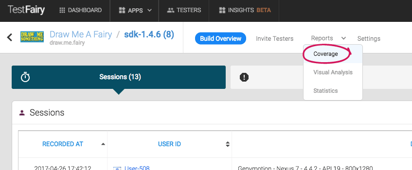
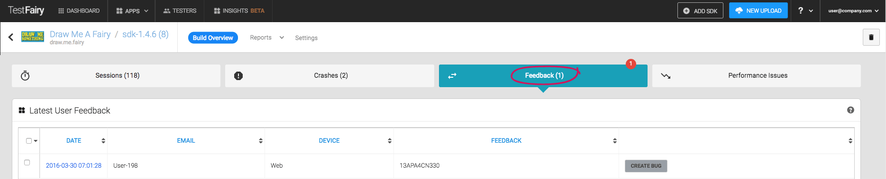

<!--# Reports-->

The reports section offers you a comprehensive numeric and visual analysis of all your tests, across devices, users and sessions. Use a bird's-eye **overview** or drill down to a particular session for more details.
You can access the reports menu from the build screen. To arrive at the **build screen**, select your **application** from the **Apps** button on the top panel, then select the **build** from the **builds** table of your application. 

 
<!--  -->

## Coverage Reports

If you have wondered how thorough your testing is, this page can help you understand exactly that. 
You can reach it from the **"reports"** dropdown in your build menu. 

 

The tables in this page show the coverage of your tests. The columns are your **app activities and fragments**, and the rows are the **devices**, **sessions** and **users** that participated in this project testing. This info will help you verify that your testers went through all the app's activities or fragments and in case they did not, you will easily understand what should be improved, and where. 

1. **Activities per Device Name**

	Click on each individual activity/fragment to drill down to a [detailed visual report](#visual_analysis) of this activity. 

	This report can be particularly crucial for your testing efforts. As you can see in the screenshot below, this application was 	not tested thoroughly on Samsung! Your tester might report that there were no crashes on a particular device, but in this graph you can see that the reason there were no crashes might be that most of the activities were not even performed on this device.

 

2. **Activities per Session**

	Click on a specific session to drill down into a <a href="http://docs.testfairy.com/Getting_Started/How-To-Analyze-Test-Results.html">detailed session analysis</a>. 

3. **Activities per Tester**

	Click on each individual activity/fragment to drill down to a [detailed visual report](#visual_analysis) of this activity.

4. **Checkpoints** 

	Checkpoints are used to provide insight regarding the way your testers use your apps.
These can help you monitor when a tester has reached key points in your app, such as or visiting the in-app store.
A checkpoint is a string written to log with the tag **testfairy-checkpoint**.

Please consult our <a href="http://docs.testfairy.com/Advanced/Checkpoints.html" target="_blank">API documentation</a> for more details on checkpoints.

 
	

	
##  Visual Analysis
	
Would you like to personally see how different activities and fragments look on different devices? This report is for you! 
Just choose the activity you want to analyse and see screenshots of what it looks like across various devices.
You can reach this report through the **"Reports"** dropdown in your build menu.

Note that visual analysis  is only available for our startup and enterprise customers.

## Statistics 

All the statistics you need are gathered on one useful page. You can reach it through the **"Reports"** dropdown in your build menu. 

1. **Performance Statistics**

	The **Performance Statistics** report is used to analyse the CPU and memory performance, as well as thread counts across different devices.

 
2. **Tester Statistics**

	The **Tester Statistics** report is used to check how many times each of your testers used your app, and for how long.
		 
		 
3. **Device Statistics**

	The **Device Statistics** report is used to analyse the amount and duration of sessions on different devices.

 
## User Feedback

It is real easy to get instant feedback from your testers without adding any new buttons to your app. All your testers need to do to access the feedback window is shake their device at any given moment. You can see their input instantly and open new relevant issues directly in your bug system from the **"Feedback"** tab in your build overview:  

<!--  -->

**What to read next:**  [Build Settings](Build_Settings.html)
 
