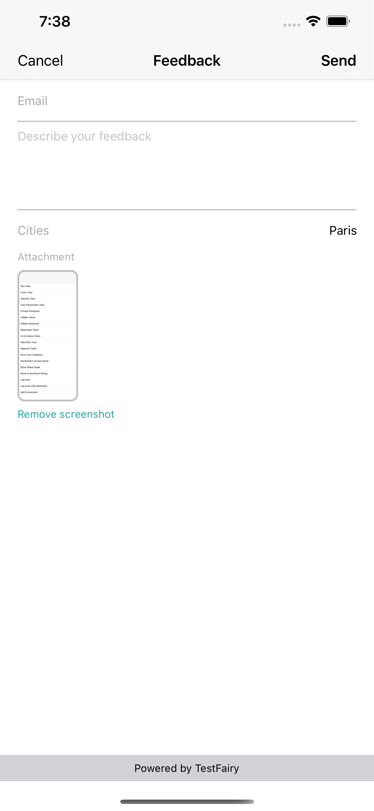
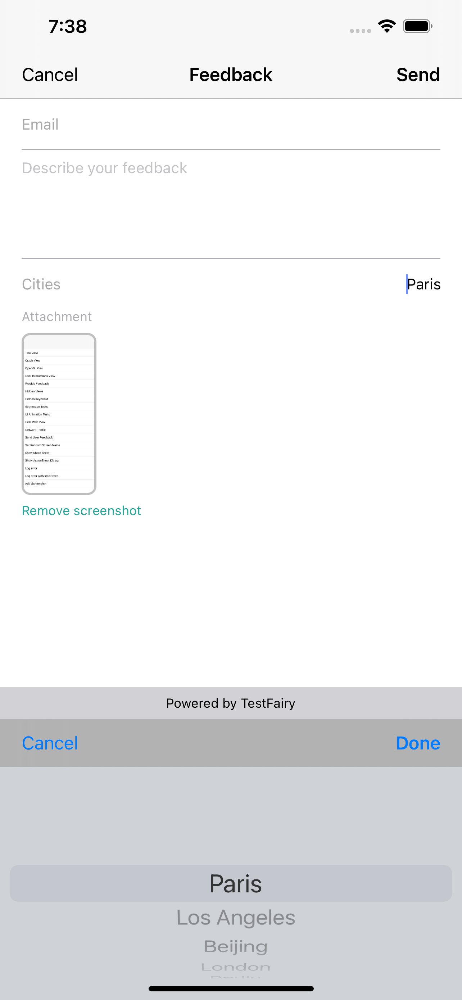
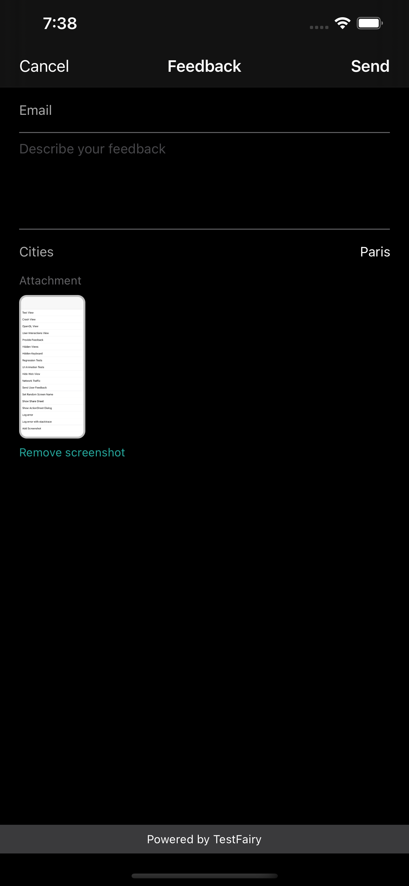
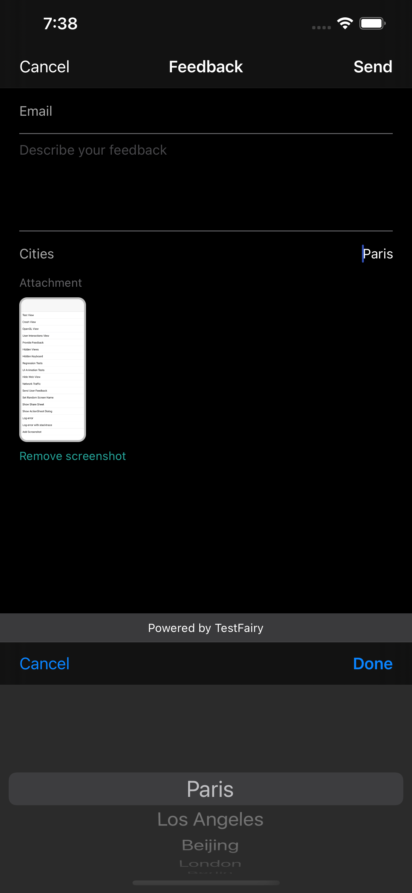

## Customizing the Feedback Dialog

In-app feedback works out of the box, allowing users to report bugs by shaking their device.

This feature is customizable and allows you to launch the feedback from from a button inside your UI or any other gesture, or change the way the feature works.

If you already called `begin` and have a session, you can simply use `showFeedbackForm` to launch the form yourself.

Otherwise, you can utilize `showFeedbackForm` anywhere in your app to launch the form without a session. The user will be presented with possible actions to take such as capturing a new screenshot or screen recording.

Here are a few methods that can help you customize the feedback behaviour:

- [`setBrowserUrl`](#setBrowserUrl): Open a web browser instead of a built-in dialog (eg, a questionnaire).
- [`setEmailFieldVisible`](#setEmailFieldVisible): Whether or not email input text should be displayed.
- [`setEmailMandatory`](#setEmailFieldVisible): Whether or not people have to identify themselves when submitting feedback.
- [`setDefaultText`](#setDefaultText): Set the initial text content of the feedback form to standardize reported feedbacks with submission guidelines.
- [`setCallback`](#setCallback): Get notified when a feedback has been sent.
- `setRecordVideoButtonVisible`: Set whether set record video button is visible.
- `setTakeScreenshotButtonVisible`: Set whether screenshot button is visible.
- [`setFeedbackInterceptor`](#setFeedbackInterceptor): Intercept sent feedbacks to modify their message, email or attached screenshot on the fly.
- [`setFeedbackVerifier`](#setFeedbackVerifier): Intercept sent feedbacks to accept or reject them based on custom logic.
- [`setFeedbackFormFields`](#setFeedbackFormFields): Create a customized Feedback form.

#### setBrowserUrl

You can setBrowserUrl, so TestFairy will open your own url for user feedback (or a questionnaire etc. ).

    

        <a data-w-tab="tab-android" class="docs-tab w-inline-block w-tab-link w--current" style="margin: 2px;" href="#android">
            
Android

        </a>
    

    

        

            <h3>Code Example</h3>
            <pre>
FeedbackOptions feedbackOptions = new FeedbackOptions.Builder()
    .setBrowserUrl("https://www.myfeedbackform.com")
    .build();
TestFairy.setFeedbackOptions(feedbackOptions);
            </pre>
        

    

#### setEmailFieldVisible / setEmailMandatory

You can decide whether the email field is visible or not, and whether the email is mandatory or not.

    

        <a data-w-tab="tab-android" class="docs-tab w-inline-block w-tab-link w--current" style="margin: 2px;" href="#android">
            
Android

        </a>
        <a data-w-tab="tab-ios" class="docs-tab w-inline-block w-tab-link" style="margin: 2px;" href="#ios-objc">
            
iOS

        </a>
    

    

        

            <h3>Code Example</h3>
            <pre>
FeedbackOptions feedbackOptions = new FeedbackOptions.Builder()
    .setEmailFieldVisible(true)
    .setEmailMandatory(true)
    .build();
TestFairy.setFeedbackOptions(feedbackOptions);
            </pre>
        

        

            <h3>Code Example</h3>
            <pre>
[TestFairy setTestFairyFeedbackOptions:[TestFairyFeedbackOptions createWithBlock:^(TestFairyFeedbackOptionsBuilder *builder) {
    builder.isEmailMandatory = YES;
    builder.isEmailVisible = YES;
}]];
            </pre>
        

    

#### setDefaultText

In order to change the default text that users see in the feedback form textarea, please use the following:

    

        <a data-w-tab="tab-android" class="docs-tab w-inline-block w-tab-link w--current" style="margin: 2px;" href="#android">
            
Android

        </a>
        <a data-w-tab="tab-ios" class="docs-tab w-inline-block w-tab-link" style="margin: 2px;" href="#ios-objc">
            
iOS

        </a>
    

    

        

            <h3>Code Example</h3>
            <pre>
FeedbackOptions feedbackOptions = new FeedbackOptions.Builder()
    .setDefaultText("Tested on the following device:\n" +
                        "\n\n" +
                        "Steps to reproduce:\n" +
                        "1.\n\n" +
                        "2.\n\n" +
                        "3.\n\n" +
                        "Actual Result:\n" +
                        "Expected Result:\n")
    .build();
TestFairy.setFeedbackOptions(feedbackOptions);
            </pre>
        

        

            <h3>Code Example</h3>
            <pre>
[TestFairy setTestFairyFeedbackOptions:[TestFairyFeedbackOptions createWithBlock:^(TestFairyFeedbackOptionsBuilder *builder) {
    builder.defaultText = @"Tested on the following device:\n" +
                        "\n\n" +
                        "Steps to reproduce:\n" +
                        "1.\n\n" +
                        "2.\n\n" +
                        "3.\n\n" +
                        "Actual Result:\n" +
                        "Expected Result:\n";
}]];
            </pre>
        

    

#### setCallback

You can get a callback to your application if a feedback was sent, cancelled or failed.

    

        <a data-w-tab="tab-android" class="docs-tab w-inline-block w-tab-link w--current" style="margin: 2px;" href="#android">
            
Android

        </a>
    

    

        

            <h3>Code Example</h3>
            <pre>
FeedbackOptions feedbackOptions = new FeedbackOptions.Builder()
    .setEmailFieldVisible(true)
    .setEmailMandatory(true)
    .setCallback(new FeedbackOptions.Callback() {
        @Override
        public void onFeedbackSent(FeedbackContent content) {
            Toast.makeText(MyActivity.this, "onFeedbackSent text = " + content.getEmail() + ", " + content.getText() , Toast.LENGTH_LONG).show();
        }

        @Override
        public void onFeedbackCancelled() {
            Toast.makeText(MyActivity.this, "onFeedbackCancelled", Toast.LENGTH_LONG).show();
        }

        @Override
        public void onFeedbackFailed(int reason, FeedbackContent content) {
            Toast.makeText(MyActivity.this, "onFeedbackFailed text = " + content.getEmail() + ", " + content.getText() , Toast.LENGTH_LONG).show();
        }
    })
    .build();

TestFairy.setFeedbackOptions(feedbackOptions);
            </pre>
        

    

#### setFeedbackInterceptor

A submitted feedback's content can be inspected with custom interceptors. Intereptors can modify the inspected feedback's message, user email or attached bitmap. This way, it is possible to add extra text to the submitted message such as ids from issue trackers and meta data relevant to current context the feedback is submitted from.

    

        <a data-w-tab="tab-android" class="docs-tab w-inline-block w-tab-link w--current" style="margin: 2px;" href="#android">
            
Android

        </a>
        <a data-w-tab="tab-ios" class="docs-tab w-inline-block w-tab-link" style="margin: 2px;" href="#ios-objc">
            
iOS

        </a>
    

    

        

            <h3>Code Example</h3>
            <pre>
FeedbackOptions feedbackOptions = new FeedbackOptions.Builder()
    .setFeedbackInterceptor(new FeedbackOptions.FeedbackInterceptor() {
        @Override
        public FeedbackContent intercept(FeedbackContent feedbackContent) {
            String exampleText = "Issue: " + generateIssueId() + "\n";

            return new FeedbackContent(
                exampleText + feedbackContent.getText(),
                feedbackContent.getEmail(),
                feedbackContent.getTimestamp(),
                feedbackContent.getBitmap()
            );
        }
    })
    .build();

TestFairy.setFeedbackOptions(feedbackOptions);
            </pre>
        

        

            <h3>Code Example</h3>
            <pre>
[TestFairy setTestFairyFeedbackOptions:[TestFairyFeedbackOptions createWithBlock:^(TestFairyFeedbackOptionsBuilder *builder) {
    builder.interceptor = ^TestFairyFeedbackContent *(TestFairyFeedbackContent *content) {
        NSString *exampleText = [NSString stringWithFormat:@"Issue: %@", [self generateIssueId]];
        return [[TestFairyFeedbackContent alloc] initWith:[NSString stringWithFormat:@"%@\n%@", exampleText, content.text]
                                                    email:content.email
                                                timestamp:content.timestamp
                                                    bitmap:content.bitmap];
    };
}]];
            </pre>
        

    

#### setFeedbackVerifier

It is also possible to define custom feedback verification logic by providing a verifier implementation.

First, implement the following interface with your custom logic. We provide an example but you can choose your own rules for the allowed feedbacks.

    

        <a data-w-tab="tab-android" class="docs-tab w-inline-block w-tab-link w--current" style="margin: 2px;" href="#android">
            
Android

        </a>
        <a data-w-tab="tab-ios" class="docs-tab w-inline-block w-tab-link" style="margin: 2px;" href="#ios-objc">
            
iOS

        </a>
    

    

        

            <h3>Code Example</h3>
            <pre>
public class MyFeedbackVerifier implements FeedbackVerifier {
    private String lastError = null;

    @Override
    public boolean verifyFeedback(FeedbackContent content) {
        lastError = null;

        if (content.getEmail() == null || content.getEmail().equals("")) {
            lastError = "Missing email address";
            return false;
        }

        if (content.getEmail().endsWith("@example.com") || content.getEmail().endsWith("@gmail.com")) {
            lastError = "Email address cannot end with @example.com or @gmail.com";
            return false;
        }

        if (content.getText().trim().length() < 10) {
            lastError = "Feedback body must be at least 10 characters long, please write something..";
            return false;
        }

        Map<String, String> attributes = content.getAttributes();
        if (attributes.containsValue("IMPORTANT_CREDENTIALS")) {
            // Example security measure to reject sensitive data coming from custom feedback form fields
            lastError = "Please remove your password from the submitted feedback.";
            return false;
        }

        return true;
    }

    @Override
    public String getVerificationFailedMessage() {
        return lastError;
    }
}
            </pre>

            
Then call the SDK with your verifier.

            <pre>
TestFairy.setFeedbackVerifier(new MyFeedbackVerifier());
            </pre>
        

        

            <h3>Code Example</h3>
            <pre>
#import <TestFairy.h>
@interface MyFeedbackVerifier: NSObject<TestFairyFeedbackVerifier>
@end

@implementation MyFeedbackVerifier {
    NSString *_lastError;
}

- (BOOL)verifyFeedback:(TestFairyFeedbackContent *)content {
    if (content.email == nil) {
        _lastError = @"Missing email address";
        return NO;
    }

    if (![content.email containsString:@"@"] && ![content.email containsString:@"."]) {
		_lastError = @"Invalid email address";
		return NO;
	}
	
	if (content.email.length < 10) {
		_lastError = @"Feedback body must be at least 10 characters long, please write something..";
		return NO;
	}

    return YES;
}

- (NSString *)getVerificationFailedMessage {
    return _lastError;
}

@end
            </pre>

            
Then call the SDK with your verifier.

            <pre>
[TestFairy setTestFairyFeedbackOptions:[TestFairyFeedbackOptions createWithBlock:^(TestFairyFeedbackOptionsBuilder *builder) {
    builder.verifier = [[MyFeedbackVerifier alloc] init];
}]];
            </pre>
        

    

#### setFeedbackFormFields

Do you want to add custom input fields to the submitted feedbacks?

TestFairy SDK is transitioning to a new layout system which provides a fully customizable feedback form experience with its `FeedbackOptions` API.

Warning : Support for custom fields is still in its early stages. All class names and method signatures may change during development.

This API consists of an interface to adapt any native view to the form, and some built-in implementations of it for basic field types such as text areas and pickers.

To get started, copy the code below and modify it according to your needs.

    

        <a data-w-tab="tab-android" class="docs-tab w-inline-block w-tab-link w--current" style="margin: 2px;" href="#android">
            
Android

        </a>
        <a data-w-tab="tab-ios" class="docs-tab w-inline-block w-tab-link" style="margin: 2px;" href="#ios-objc">
            
iOS

        </a>
        <a data-w-tab="tab-flutter" class="docs-tab w-inline-block w-tab-link" style="margin: 2px;" href="#flutter">
            
Flutter

        </a>
    

    

        

            <h3>Code Example</h3>
            <pre>
NSArray *formFields = @[
    [[TestFairyStringFeedbackFormField alloc] initWithAttribute:@":userId" // :userId is built-in for emails
                                                             label:@"Email "
                                                       placeholder:nil
                                                      defaultValue:@""],
[[TestFairyTextAreaFeedbackFormField alloc] initWithAttribute:@":text" // :text is built-in for feedback messages
                                                     placeholder:@"Describe your feedback"
                                                    defaultValue:@""],
[[TestFairySelectFeedbackFormField alloc] initWithAttribute:@"city"
                                                      label:@"Cities"
                                                     values:@{
                                                            @"London": @"LON", // humanReadableName: machineReadableName
                                                            @"Paris": @"PAR",
                                                            @"Berlin": @"BER",
                                                            @"Los Angeles": @"LA",
                                                            @"Beijing": @"BEI",
                                                     }
                                                defaultValue:@"Paris"],
];

[TestFairy setTestFairyFeedbackOptions:[TestFairyFeedbackOptions createWithBlock:^(TestFairyFeedbackOptionsBuilder *builder) {
    builder.feedbackFormFields = formFields;
}]];
            </pre>

            
Here is the form generated in the example above.

            
             
            
             

            <h3>Built-in Form Elements</h3>
            
<code>feedbackFormFields</code> expects a list of <code>TestFairyFeedbackFormField</code> objects, which is a protocol any app developer can implement to inject custom made views into the form hierarchy.

            
However, the SDK provides a few, ready to use elements listed below:

            <h4>TestFairyStringFeedbackFormField</h4>
            
A single line text input. Mainly used for emails, phone numbers and similar identifiers.

            <h4>TestFairyTextAreaFeedbackFormField</h4>
            
A multi line text input. Mainly used for feedback messages and Q/A sections.

            <h4>TestFairySelectFeedbackFormField</h4>
            
A single choice picker for choosing from a set of predefined values. Mainly used for area codes, currencies or questions with single, definite answers.

        

        

            <h3>Code Example</h3>
            <pre>
Map<String, String> cities = new HashMap<>();
// cities.put(humanReadableName, machineReadableName)
cities.put("London", "LON");
cities.put("Paris", "PAR");
cities.put("Berlin", "BER");
cities.put("Los Angeles", "LA");
cities.put("Beijing", "BEI");

List<FeedbackFormField> fields = new ArrayList<>();
fields.add(new StringFeedbackFormField(":userId", "Email", "")); // :userId is built-in for emails
fields.add(new TextAreaFeedbackFormField(":text", "Your message", "")); // :text is built-in for feedback messages
fields.add(new SelectFeedbackFormField("city", "City", cities, "Paris" /*default value*/)); // A custom select field

TestFairy.setFeedbackOptions(
    new FeedbackOptions.Builder()
        .setFeedbackFormFields(fields)
        .build()
);
            </pre>

            
Here is the form generated in the example above.

            
            
             
            
            
             
	    
	    
If you just need to localize the form without changing its structure, you can use the snippet below and define your strings in *res/values/strings.xml* as usual.

	    <pre>
Resources resources = context.getResources();
List fields = new ArrayList<>();

fields.add(new StringFeedbackFormField(":userId", resources.getString(R.string.email), "")); // :userId is built-in for emails
fields.add(new TextAreaFeedbackFormField(":text", resources.getString(R.string.description), "")); // :text is built-in for feedback messages

TestFairy.setFeedbackOptions(
    new FeedbackOptions.Builder()
        .setFeedbackFormFields(fields)
        .build()
);
            </pre>

            <h3>Built-in Form Elements</h3>
            
<code>setFeedbackFormFields</code> expects a list of <code>FeedbackFormField</code> objects, which is an interface any app developer can implement to inject custom made views into the form hierarchy.

            
However, the SDK provides a few, ready to use elements listed below:

            <h4>StringFeedbackFormField</h4>
            
A single line text input. Mainly used for emails, phone numbers and similar identifiers.

            <h4>TextAreaFeedbackFormField</h4>
            
A multi line text input. Mainly used for feedback messages and Q/A sections.

            <h4>SelectFeedbackFormField</h4>
            
A single choice picker for choosing from a set of predefined values. Mainly used for area codes, currencies or questions with single, definite answers.

        

        

            <h3>Code Example</h3>
            <pre>
  final List<FeedbackFormField> fields = <FeedbackFormField>[
    StringFeedbackFormField('fullname', 'Your name', ''),
    TextAreaFeedbackFormField('bio', 'Bio', 'Tell us about yourself'),
    SelectFeedbackFormField(
        'country',
        'Country',
        <String, String>{'Turkey': '+90', 'Canada': '+1', 'Israel': '+972'},
        'Canada')
  ];

  await TestFairy.setFeedbackOptions(feedbackFormFields: fields);
  await TestFairy.showFeedbackForm();
            </pre>

            
Here is the form generated in the example above.

            
            
             
            
            
             

            <h3>Built-in Form Elements</h3>
            
<code>setFeedbackFormFields</code> expects a list of <code>FeedbackFormField</code> objects. The SDK provides a few, ready to use elements listed below:

            <h4>StringFeedbackFormField</h4>
            
A single line text input. Mainly used for emails, phone numbers and similar identifiers.

            <h4>TextAreaFeedbackFormField</h4>
            
A multi line text input. Mainly used for feedback messages and Q/A sections.

            <h4>SelectFeedbackFormField</h4>
            
A single choice picker for choosing from a set of predefined values. Mainly used for area codes, currencies or questions with single, definite answers.

        

    

### Automatic Email Detection

The feedback form uses following heuristics to determine how to fill its email field.

- If you provide an email address to `setUserId`, it will be automatically detected by the form.
- If you set an attribute via `setAttribute` with a key of `"email"`, the form will make use of it.
- If the user sends a feedback with a valid email address, it will also be saved for later use in case rules above cannot detect any other addresses.
