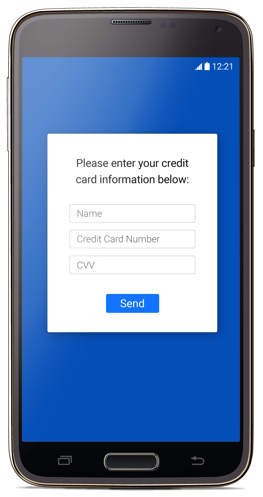
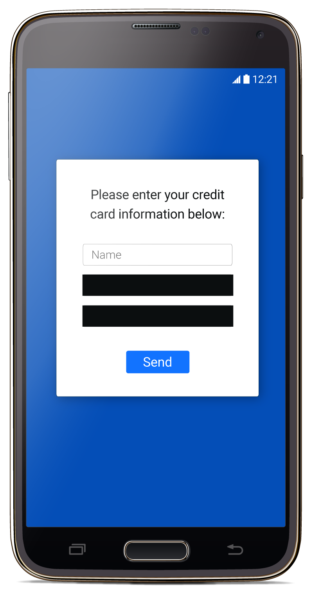

TestFairy allows the developer to hide specific views from the recorded video. As the developer, you may choose to hide one or more views from video for security and privacy reasons.

For example, you might want to remove all information related to credit card data from appearing in the session.

### Syntax

To hide a view from video, all you need to do is :

**`TestFairy.hideView(Integer.valueOf(R.id.my_view));`**
**`TestFairy.hideView(View myView);`**

Replace *R.id.my_view* with the identifier of the view you wish to hide. Please review the full example below.

### Code example
```
public class MyActivity extends Activity {
        @Override
        protected void onCreate(Bundle savedInstanceState) {
                super.onCreate(savedInstanceState);
                setContentView(R.layout.my_activity);

                TestFairy.hideView(Integer.valueOf(R.id.credit_card_number));
                
                //or use 
                View creditCardNumber = findViewById(R.id.credit_card_number);
                TestFairy.hideView(creditCardNumber);
        }
}
```

### Sample video

Below is a sample screen taken from a demo video. On the left, this is how the app looks like normally. On the right is a screenshot taken with the "Card Number" EditText hidden by testfairy-secure-viewid.





### Notes

* Views hidden are removed **before** sending video.
* You may use '***TestFairy.hideView(Integer.valueOf(R.id.my_view))***' on multiple Views.
* You may add the same view multiple times, no checks needed.


