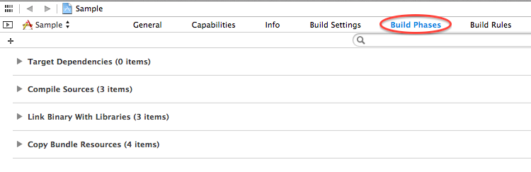
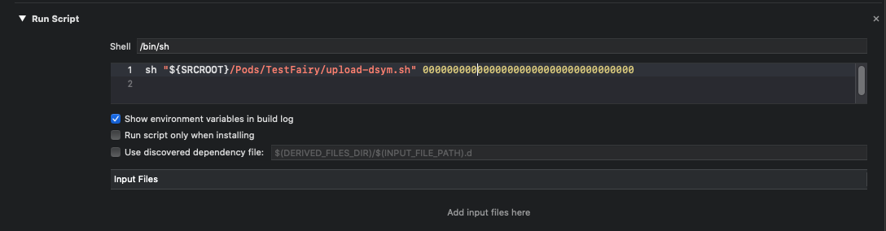

TestFairy crash reports are easier to understand when they show actual debug symbols instead of addresses. To enable this, you'll need to upload your debug symbols to TestFairy. 
There are several ways to do that.

Let's get started.

### Before you begin, set Xcode to create debug symbols
First, make sure your Xcode project is configured to generate the debug symbols:
 
1. Click on your project and select Build-Settings.
2. In the search box, type “Debug Information Format”.
3. Click on “Debug Information Format” and select “DWARF with dSYM File”


### Select your convinient method to upload debug symbols ###
There are different ways to upload the debug symbols: 
* [Using our app upload API](#upload-dsym-using-the-upload-api): upload your ipa with the debug symbols.
* [Using the TestFairy Jenkins plugin](#upload-dsym-using-the-testFairy-jenkins-plugin): upload your ipa with the debug symbols.
* [Straight from Xcode](#upload-dsym-from-xcode): when you don't distribute your ipa with TestFairy.
* [Use our dsym upload script](#upload-dsym-using-a-script): if you don't use xcode and not distributing the app with TestFairy.
* [From the build settings menu in TestFairy](#uploading-the-dsym-through-your-testfairy-dashboard): if you upload your app from the dashboard.
* [There are also specific instructions for Xamarin](#debug-symbols-for-xamarin-apps)

### Upload dSYM using the upload API ###

We recommend uploading dSYM files together with the app build files.
Use our upload API when the app is ready for distribution and testing, and add the dSYM files as well.

1. Create a zip file from the contents of your symbols directory. This directory is usually found under this location:
     ```
    {XCODE}/DerivedData/{APP_DERIVED_DATA}/Builds/Products/{TARGET}/
     ```
     
    For example, this commands creates a zip file called symbols.zip  from the symbols of my ‘Hi’ app and stores it under the /tmp directory.
     
     ```
    zip -r /tmp/symbols.zip 
    ~/Library/Developer/Xcode/DerivedData/Hi-qqqqq/Build/Products/Debug-iphoneos/Hi.app.dSYM/*
     ```
     
2. Run the upload command:
    ```
    
    curl https://app.testfairy.com/api/upload \
        -F api_key='YOUR_API_KEY GOES HERE' \
        -F file='YOUR IPA FILE GOES HERE' \
        -F symbols_file='YOUR ZIPPED SYMBOLS FILE GOES HERE' \
        -F metrics='cpu,network,logcat' \
        -F testers_groups='friends,beta' \
        -F notify='on'
     ```
     
You may also use our script that contains this command and use it in your build process. [Click here to download script](https://github.com/testfairy/command-line-uploader/blob/master/testfairy-uploader.sh)

If you need further instructions regarding out upload API, [read about it here](https://docs.testfairy.com/)

### Upload dSYM using the TestFairy Jenkins Plugin ###

We recommend uploading dSYM files together with the app build files.
If you are using Jenkins for continuous integration, you can use the Jenkins TestFairy plugin to upload your app and add the dSym along the way.

1. If you did not use the TestFairy Jenkins plugin before, see the [installation instructions.](https://wiki.jenkins-ci.org/display/JENKINS/TestFairy+Plugin)

2. Enter your app build configuration in Jenkins.

3. Create a build step that executes a shell command to zip the symbols. The symbols directory is usually found under this location:

    ```
    {XCODE}/DerivedData/{APP_DERIVED_DATA}/Builds/Products/{TARGET}/  
    ```

	For example, this commands creates a zip file called symbols.zip  from the symbols of my ‘Hi’ app and stores it under the /tmp directory.

	```
	zip -r /tmp/symbols.zip
	~/Library/Developer/Xcode/DerivedData/Hi-qqq/Build/Products/Debug-iphoneos/Hi.app.dSYM/*
	 ```
    
4. Open the job configuration post build actions for the TestFairy Plugin.

5. Enter the full dSYM zip file location inside the “Path to dSYM zip” field.

6. Once you run the build, Jenkins will compress the symbols directory, upload your app and the zipped symbols to TestFairy.


If a crash will occur, Testfairy will add the symbols to the crash report so you can understand what is going on.

### Upload dSYM from Xcode ###

If you don’t plan to distribute your app build through testfairy, but you added the SDK to your code and want to see crash reports, you can upload your dSYM straight from XCode.

1. In Xcode, click on your project in the left sidebar, then click on **Build Phases**.



2. Click on ***plus sign*** on the left and select **New Run Script Build Phase**


3. Open the newly added **Run Script** and add this line at the bottom:

```sh
sh "$SRCROOT/TestFairy/upload-dsym.sh" UPLOAD_API_KEY
```

Make sure to reply **UPLOAD_API_KEY** with the your secret upload api key, found in the [Settings](https://app.testfairy.com/settings/) page.



##### Fatal: Can't find .dSYM folder!

If while compiling you get the error `Fatal: Can't find .dSYM folder!`, it could be that your project is not configured to generate debug symbols. 
Please perform the following actions:

1. Click on your project and select Build-Settings.

2. In the search box, type “Debug Information Format”.

3. Click on “Debug Information Format” and select “DWARF with dSYM File”


### Upload dSYM using a script ###
If you are not planning to upload your app to TestFairy and you are not using Xcode, follow these instrucitons to upload your debug symbols:

1. Download the upload dSYM script from [here]("https://s3.amazonaws.com/testfairy/sdk/upload-dsym.sh")
Locate your dSYM directory. It can be found under
     
     ```
    {XCODE}/DerivedData/{APP_DERIVED_DATA}/Builds/Products/{TARGET}/  
      ```
      
 For example, the dsym file for my ‘Hi’ app is stored here:     
	```
	~/Library/Developer/Xcode/DerivedData/Hi-qqq/Build/Products/Debug-iphonesimulator/Hi.app.dSym
	```
      
2. Locate your Upload API Key, you can find it here (make sure not to use your App-token, which is a different thing entirely).
3. Run this script: 
  
	 ```
	./Upload-dsym.sh -f TESTFAIRY_UPLOAD_API_KEY -p DSYM_PATH
	 ```
      
Once you run the script it will compress the symbols directory and upload the symbols to TestFairy. 
If a crash will occur, Testfairy will add the symbols to the crash report so you can understand what is going on.

### Uploading the dsym through your TestFairy Dashboard ###
If you upload apps straight from the TestFairy dashboard, upload your debug symbols from the build-settings page. Here is how you do it:

1. Create a zip file from the contents of your symbols directory. This directory is usually found under this location:

	``` 
	{XCODE}/DerivedData/{APP_DERIVED_DATA}/Builds/Products/{TARGET_NAME}/  
	```
	
    
For example, this commands creates a zip file called symbols.zip  from the symbols of my ‘Hi’ app and stores it under the /tmp directory:

	```
	zip -r /tmp/symbols.zip
	~/Library/Developer/Xcode/DerivedData/Hi-qqq/Build/Products/Debug-iphoneos/Hi.app.dSYM/*
	 ```


2. Login to TestFairy.

3. Enter the app overview page by clicking on the App.

4. Enter the build overview page by clicking on the build you wish to upload symbols for
(If you only have one build, you will not see a list of builds, but rather land directly on the correct build overview page).

5. From the Build Overview menu, click ‘Settings’ and select the ‘More Tab’.
6. Upload your zipped symbols file.

If a crash will occur, Testfairy will add the symbols to the crash report so you can understand what is going on.

### Debug Symbols for Xamarin apps ###
If you are using Xamarin, please refer to instructions in [this page.](https://docs.testfairy.com/Platforms/Xamarin.html)


