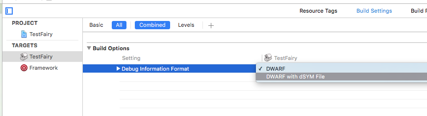

<iframe width="560" height="315" src="https://www.youtube.com/embed/E64kWHOMgVY" frameborder="0" allowfullscreen></iframe>

With TestFairy, symbolicating crash reports is easy as pie. A simple Build Phase script can automatically upload the compressed .dSYM file for future symbolicaton.

To enable automatic uploads of .dSYM file, please follow these steps:

#### Step 1:

In XCode, click on your project in the left sidebar, then click on **Build Phases**.


#### Step 2:

Click on ***plus sign*** on the left and select **New Run Script Build Phase**


#### Step 3:

Open the newly added **Run Script** and add this line at the bottom:

```sh
sh "$SRCROOT/TestFairy/upload-dsym.sh" UPLOAD_API_KEY
```

Make sure to reply **UPLOAD_API_KEY** with the your secret upload api key, found in the [Settings](https://app.testfairy.com/settings/) page.


### Fatal: Can't find .dSYM folder!

If while compiling you get the error `Fatal: Can't find .dSYM folder!`, it could be that your project is not configured to generate debug symbols. To output debug symbols, enable the option from `Target > Build Options > Debug Information Format`. If you don't see option, make sure you're not viewing the `Basic` options; instead, select `All` options. You can see the option in the following screenshot



### Multiple dSYMs? No problem!

You can upload multiple dSYMs per build. Some developers have frameworks developed in-house, and these frameworks make it to the final .IPA file. In order to upload dSYM in your framework project, just implement **Run Script** above in your framework's settings.


