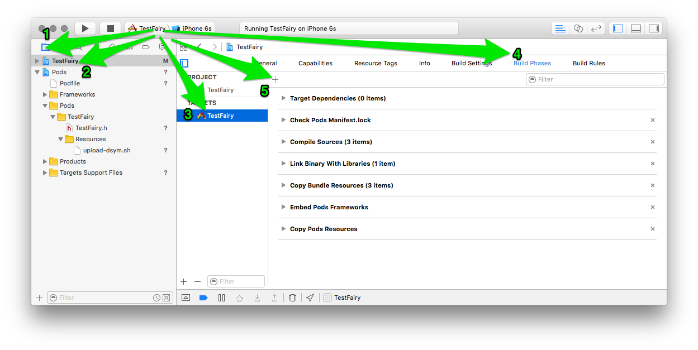
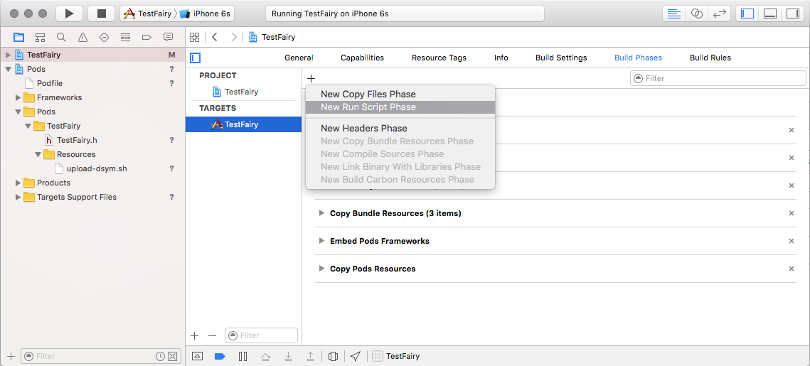
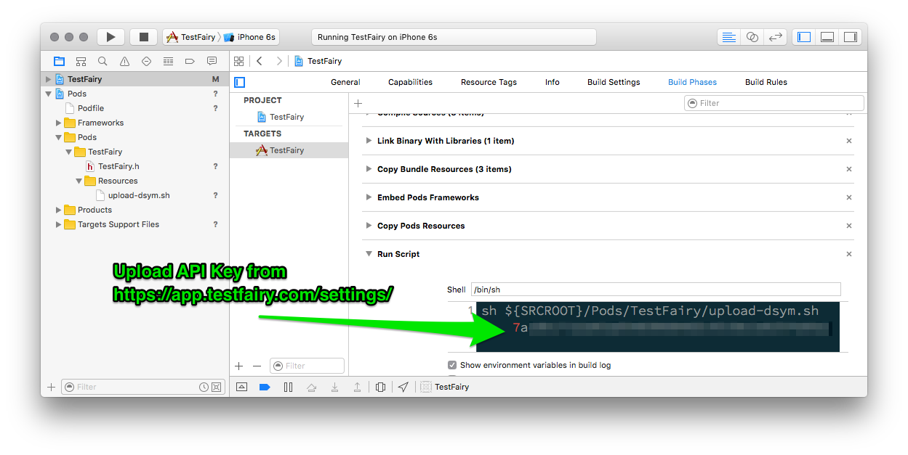

## Adding TestFairy to your Podfile
Add the *TestFairy* pod to your Podfile by inserting the following line where applicable: 
```
pod 'TestFairy'
```

## Automatically uploading dSYMs

With TestFairy, symbolicating crash reports is easy as pie. A simple Build Phase script can automatically upload the compressed .dSYM file for future symbolicaton.

In your project, navigate to your project's `Build Phases`



Add a `New Run Script Phase`



Paste the following script into the created space



```
sh ${SRCROOT}/Pods/TestFairy/upload-dsym.sh <Upload API Key from https://app.testfairy.com/settings/>
```

And you're done!