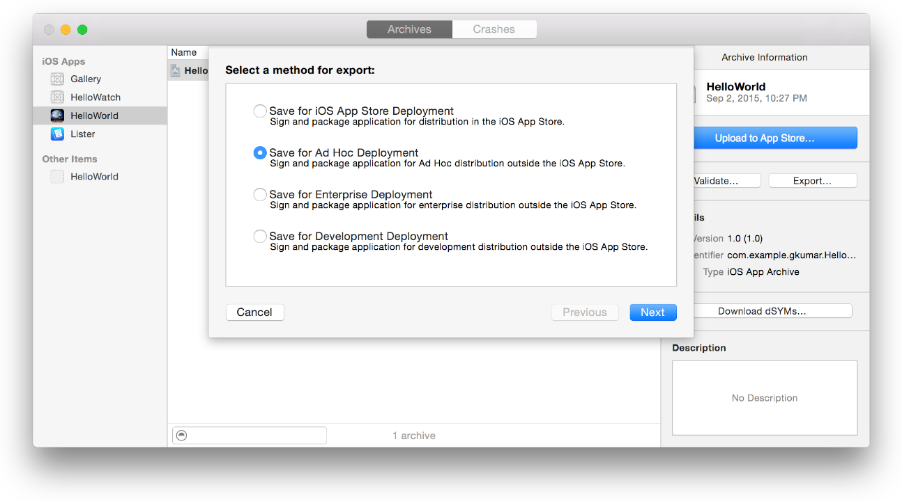
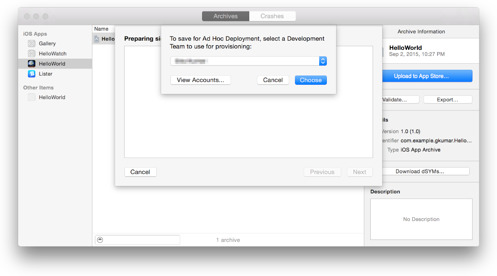
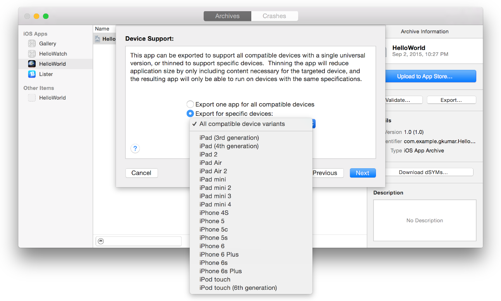

Apple allows app distribution for testing on registered devices using an ad hoc provisioning profile or team provisioning profile. The output file you create is an iOS App file (a file with an `.ipa` filename extension) that they can then use to install your app on registered devices. Following are the steps to export your app for testing:

1. Register all test devices.
1. Archive your app.
1. Export the archive to an IPA file using either an ad hoc provisioning profile or team provisioning profile to code sign your app.
1. Install the app on test devices.

## About Ad Hoc Provisioning Profiles

An ad hoc provisioning profile is a distribution provisioning profile that allows your app to be installed on designated devices and to use app services without the assistance of Xcode. It’s one of the two types of distribution provisioning profiles you can create for apps.

Make sure you have created an ad hoc provisioning profile specifying an App ID that matches one or more of your apps, a set of test devices, and a single distribution certificate at the [developer portal](https://idmsa.apple.com/IDMSWebAuth/login?&appIdKey=891bd3417a7776362562d2197f89480a8547b108fd934911bcbea0110d07f757&path=%2F%2Fmembercenter%2Findex.action).

## Archiving Your App

Create an archive of your app. Xcode stores this archive in the Archives organizer.

In the Xcode project editor, choose a generic device—Generic iOS Device—or your device name from the Scheme toolbar menu. You can’t create an archive of a simulator build. If a device is connected to your Mac, the device name appears in the Scheme toolbar menu. When you disconnect the device, the menu item changes to the generic device name.

Choose Product > Archive.The Archives organizer appears and displays the new archive. Xcode runs preliminary validation tests on the archive and may display a **"validate"** warning in the project editor. For example, if you are not using asset catalogs and don’t set required app icons, as described in Setting Individual App Icon and Launch Image Files, an **"Info.plist"** warning message appears. If you see this warning, fix the issue and re-create the archive.

## Exporting Your App to IPA

To create an iOS App file for testing, select the archive in the Archives organizer.

Click the Export button, select an export option, and click Next. To distribute your app to users with designated devices, select “Save for Ad Hoc Deployment.” The app will be code signed with the distribution certificate.

In the dialog that appears, choose a team from the pop-up menu and click Choose. If necessary, Xcode creates the needed signing identity and provisioning profile for you.

In the Device Support dialog, choose whether to export the universal app or a variant for a specific device, and click Next.
* If you want to run the app on any supported device, select “Export one app for all compatible devices.”  
* If you want to test all device variances, select “Export for specific devices” and choose “All compatible device variants” from the pop-up menu.  
* If you want to test a specific device variant, select “Export a thinned app for a specific device” and choose the device family from the pop-up menu.  

In the dialog that appears, review the app, its entitlements, and the provisioning profile.
The ad hoc provisioning profile should begin with the text `XC Ad Hoc:`. The team provisioning profile should begin with the text `[platform] Team Provisioning Profile: [App ID]`. Review the build options, and click Next. Click Export and finally the Finder shows the exported files.

## Installing Your App on Test Devices Using Xcode

You can install iOS App files on devices using Xcode.

To install an app on a device using Xcode

1. Connect the device to your Mac.
1. In Xcode, choose Window > Devices and select the device under Devices.
1. In the Installed Apps table, click the Add button (+) below the table.
1. In the dialog that appears, choose the iOS App file and click Open

##  Accessing Logs from Xcode

Accessing raw logs on an iOS device requires hooking up that device via a USB cable to a computer. System logs often help a lot in debugging vague problems around app installation.

Many times, the error displayed on an iOS device screen is too generic, but the system logs explain more thoroughly the reason for the problem. In order to get the logs, complete the following:

* Open Xcode.
* Open menu Window -> Devices.
* Select the device which you want to inspect.
* Click on the little arrow toggle button at the bottom of the window.
* A new divider will open up with up-to-date logs from the device.

# References

1. [Apple developer site](https://developer.apple.com/library/ios/documentation/IDEs/Conceptual/AppDistributionGuide/TestingYouriOSApp/TestingYouriOSApp.html)
