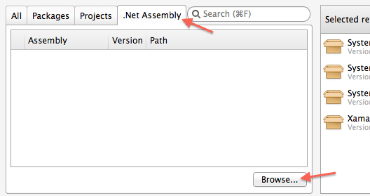

Adding TestFairy to your Xamarin project lets you record and understand how people use your app. It also provides a crash handler, 
analytics tools and performance benchmarks.

The Xamarin TestFairy component is also available at the [Xamarin components store](https://components.xamarin.com/view/testfairy.xamarin-ios)

### Manual Integration

1. Download and unzip the Xamarin component: [Unified API](https://app.testfairy.com/sdk/ios/download/latest/xamarin-unified/) [Classic API](https://app.testfairy.com/sdk/ios/download/latest/xamarin-classic/).

2. In your Solution, right-click on *References* and select *Edit References*.
> 

3. In *Edit References*, select *.Net Assembly* tab and click *Browse...*, locate the **TestFairy.iOS.dll** file you just downloaded and unzipped.
> 

4. Initialize the TestFairy framework :

    * Open your **AppDelegate.cs** file.
    
    * Add this line to your *using* section:
    `using TestFairyLib;`
    
    * Locate ***FinishedLaunching** and add to following line of code. Replace
    ***TESTFAIRY_APP_TOKEN*** with the *App Token* from your [Account Settings page](https://app.testfairy.com/settings#apptoken).
        ```
        TestFairy.Begin ("TESTFAIRY_APP_TOKEN");
        ```
	
	* In case you don't have such method, override it by adding the following lines:
        ```    
        public override bool FinishedLaunching (UIApplication application, NSDictionary launchOptions)
        {
            TestFairy.Begin ("TESTFAIRY_APP_TOKEN");
            return true;
        }
        ```


### Using Advanced Features

The Xamarin component supports all functionality as its iOS SDK counterpart. The following methods are available:

* `Pause();`
* `Resume();`
* `HideView();`
* `Checkpoint();`
* `PushFeedbackController();`
* `SetCorrelationId(string correlationId);`


