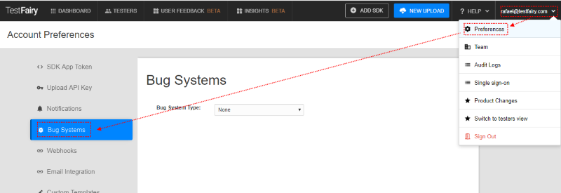

# Connetcing your GitHub issues

1. Go to your account preferences under your account email (right side of screen) - select Bug systems.

2. select Github issue from the menu and follow the OAuth process

3. after connecting to your Github account for each app, you can select a repository

* Make sure to press the Update 'GitHub Settings button' when you choose or update a repository.
