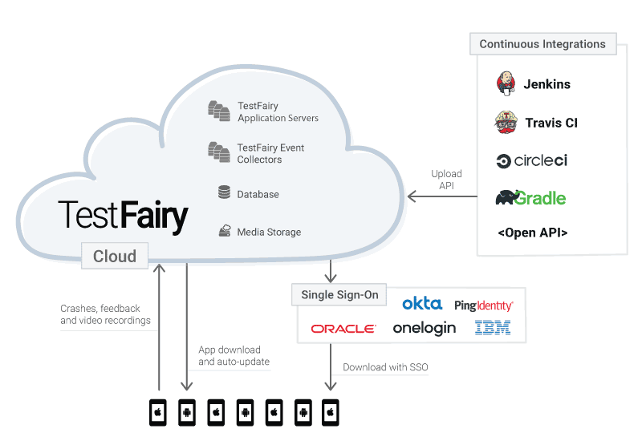

Single Sign-on enables you to manage users and testers outside of TestFairy. 
TestFairy supports SAML and is fully compatible with Okta, OneLogin, Ping, Oracle, IBM and Azure ADFS.

When SSO is configured into your account, the login page is replaced with a simple login with sso button.

### Setting up SSO with TestFairy
Following are pages with directions for setting up SSO with TestFairy, according to your chosen solution:

  * [OKTA](https://docs.testfairy.com/Single_Sign-On/OKTA.html)

  * [OneLogin](https://docs.testfairy.com/Single_Sign-On/OneLogin.html)

  * [PingIdentity](https://docs.testfairy.com/Single_Sign-On/Ping_Identity.html)

  * [Azure Active Directory](https://docs.testfairy.com/Single_Sign-On/Azure_Active_Directory.html)

Talk to us! [Request a demo](https://testfairy.com/products/solutions/enterprise#request-a-demo)

