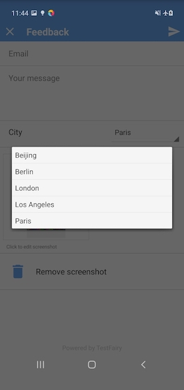
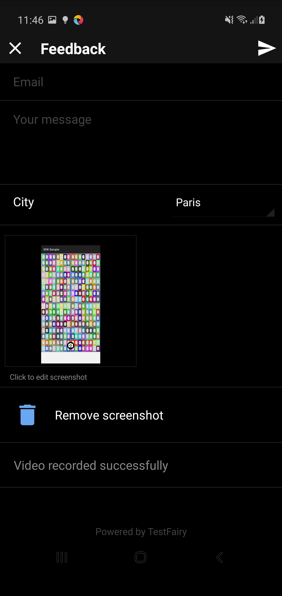
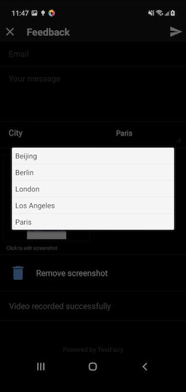

Do you want to add custom input fields to the submitted feedbacks?

TestFairy SDK is transitioning to a new layout system which provides a fully customizable feedback form experience with its `FeedbackOptions` API.

Warning : Support for custom fields is still in its early stages. All class names and method signatures may change during development.

This API consists of an interface to adapt any native view to the form, and some built-in implementations of it for basic field types such as text areas and pickers.

To get started, copy the code below and modify it according to your needs.

```java
			Map<String, String> cities = new HashMap<>();
			//cities.put(humanReadableName, machineReadableName)
			cities.put("London", "LON");
			cities.put("Paris", "PAR");
			cities.put("Berlin", "BER");
			cities.put("Los Angeles", "LA");
			cities.put("Beijing", "BEI");

			List<FeedbackFormField> fields = new ArrayList<>();
			fields.add(new StringFeedbackFormField(":userId", "Email", "")); // :userId is built-in for emails
			fields.add(new TextAreaFeedbackFormField(":text", "Your message", "")); // :text is built-in for feedback messages
			fields.add(new SelectFeedbackFormField("city", "City", cities, "Paris" /*default value*/)); // A custom select field

			TestFairy.setFeedbackOptions(
				new FeedbackOptions.Builder()
					.setFeedbackFormFields(fields)
					.setFeedbackInterceptor(new MyFeedbackInterceptor()) // Implement an interceptor to modify user input before feedback submission
					.build()
			);

      TestFairy.setFeedbackVerifier(new MyFeedbackVerifier()); // Implement a verifier for custom validation
			TestFairy.showFeedbackForm(context, APP_TOKEN, false);
```

Values set in these fields will be accessible by feedback interceptors and verifiers under `FeedbackContent::getAttributes()`.

Here is the form generated in the example above.







### StringFeedbackFormField

A single line text input. Mainly used for emails, phone numbers and similar identifiers.

### TextAreaFeedbackFormField

A multi line text input. Mainly used for feedback messages and Q/A sections.

### SelectFeedbackFormField

A single choice picker for choosing from a set of predefined values. Mainly used for area codes, currencies or questions with single, definite answers.

### FeedbackFormField

An interface any app developer can implement to inject custom made views into the form hierarchy.
